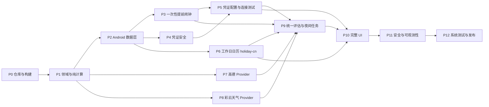

# 通勤闹钟可执行实施任务

- 对应规格：[`SPEC.md`](./SPEC.md)
- 起点：仓库已删除后端、contract、calendar-data、infra 与旧草稿；保留 `android/` 工程（app、core/{model,data,network,alarm,map}、feature/*）
- 目标：从纯 Android 本地优先架构推进到可公开发布的 Android 应用
- Android 包名：`com.ljwzz.weathertrafficalarm`
- 当前天气 Provider：未接入；高德 Android SDK、Web API、加密运行时 Key、专项授权、地图／定位／POI、五种路线、三条候选、路况和计划覆盖已实现。待用户提供 Web Service Key 与 Android SDK Key 后完成设备实网验收。
- 后续规划：彩云天气 v2.6；高德 Web 服务 API 与 Android SDK。
- 工作日数据源：holiday-cn 年度 JSON（App 抓取缓存）
- 页面与原型交接：见 [`docs/design-handoff.md`](./docs/design-handoff.md)；Figma 的 21 个页面是视觉素材基线，当前 Android 范围为 12 个主页面及路线／日历功能整合。

> 2026-08-31 当前执行线先完成本地闹钟；2026-09-01 已完成 `P7` 高德 Provider。天气和提前计算保留为后续能力，不得用模拟结果替代。每个任务是否完成必须以本轮构建、测试和设备记录为准。

> 2026-09-01 高德实现：Android 已完成授权、运行时 Web／SDK Key加密存储、地图、单次定位、地点输入提示／搜索、五种路线、最多三条备选、路况和计划覆盖；原型继续以离线 fixture 验收相同页面状态。待用户提供两项真实 Key 后进行设备实网验收。

## 1A. 本地闹钟优先执行线

### [x] L001 日期规则与下一次实例

- 扩展计划为 `Once(date)`、`Weekly(days)`、`Workdays`；计划保存时固定设备时区。
- 单次过去时间拒绝保存；每周至少一天；当天默认 06:00 已过时选择次日；跨日、月底、闰日、时区和夏令时计算有单元测试。

### [x] L002 本地闹钟实例与持久化

- 实例含唯一 ID、计划 ID、计划版本、触发时刻、父实例 ID 和结果状态；区分启用意图与 `PENDING_PERMISSION`、`REGISTERED`、`REGISTRATION_FAILED`、`COMPLETED`。
- Room 使用显式迁移；旧演示计划缺少日期规则时要求选择规则后才可启用。迁移、重启持久化和取消编辑不写入必须测试。

### [x] L003 LocalAlarmCoordinator 与系统调度

- 页面只调用 `LocalAlarmCoordinator`；该协调器负责保存、启停、删除、下一次计算、注册、触发、停止、贪睡和恢复。
- 使用 `setAlarmClock()` 注册下一次有效实例；新实例注册成功后才取消旧实例；能力缺失或异常显示真实失败原因，不显示已注册。

### [x] L004 响铃、贪睡与恢复

- Receiver 校验实例、版本和状态，重复广播幂等；前台响铃服务处理循环铃声、振动、停止和 10 分钟默认贪睡。
- 贪睡为独立子实例；单次完成后停用；重复规则安排下一次；重启、解锁、时间变更、覆盖安装和 10 分钟迟到边界均有测试。

### [x] L005 本地页面与真实状态

- 闹钟 CRUD、首页下一次有效闹钟、记录空态／实际事件、日期与结果筛选、真实日历月份和按计划按日期覆盖。
- 设置持久化、全局通勤与计划覆盖、地点与出行方式保存；天气的 Android 实网与界面验证见 `android/qa/caiyun-device-2026-09-02.md`，自动提前计算已接入 P9 统一评估与独立提前实例；高德地图与路线按 2026-09-01 离线 fixture 契约验收。

### [x] L006 凭据与能力诊断

- 凭据使用 Keystore 加密保存和清除；测试明确未接入且不发请求。
- Android 读取通知、精确闹钟、全屏提醒和闹钟音量状态，提供设置入口并在返回后重新检查。

### [x] L007 本地验收

- 单元、迁移、UI 和 API 36 模拟器覆盖计划范围；设备响铃、锁屏、停止、贪睡、进程回收、重启恢复单独记录。
- Debug APK、测试结果和截图是交付物；未做的真机验证不得标记通过。

验收记录：[`android/qa/README.md`](./android/qa/README.md)。JVM 129 项、Android 36 设备 7 项、原型 15 项通过；另完成 holiday-cn 设备联网验证和未解锁重启响铃验证。实体设备及发布环境仍按验收记录中的边界处理。

### [x] L011 权限引导设计与离线原型

- 以 Figma `133:632` 状态组和本地离线原型交付首次启用引导：通知、精确闹钟、全屏提醒、锁屏显示与后台弹出页面分别呈现用途、引导入口、返回检查与结果状态；缺失项说明后仍可继续启用。
- 小米锁屏显示与后台弹出页面使用手工设置说明和用户确认状态；位置权限从“使用当前位置”单次入口发起，并覆盖大致位置、精确位置、拒绝和定位服务关闭的演示结果。
- 离线原型为每个系统授权入口演示说明、系统跳转和返回状态；工具栏支持设备和场景切换。运行时演示状态与待续操作只保留在当前会话。同一会话内，明确点按继续启用后，同一缺失状态不再重复提示；返回保留草稿，取消不写入也不消费确认，后续主动保存仍需确认；继续操作按当前计划和会话幂等。

验收：开发工作区原型测试 `50/50` 通过；提交前仅导出权限暂存快照重新验证，`39/39` 通过。浏览器离线流程验证通过；Figma QA 实读验证 33 个固定场景、109 条预期连接及全部覆盖层边界，字体仅 Noto Sans SC／Roboto。启用、位置请求与小米最长确认文案完成关键视觉复核。Figma 图形连线用于离线交互追溯，不构成实际系统权限验证。台账与浏览器记录见 [`figma-state.json`](./prototype/qa/permissions-2026-09-03/figma-state.json) 和 [`权限原型浏览器验收`](./prototype/qa/permissions-2026-09-03/README.md)。

### [x] L012 Android 原生权限引导

- `PermissionAccess`、`PermissionScreens` 与 `ZhituApp` 读取并展示通知运行时授权、通知渠道、精确闹钟、全屏提醒、前台粗精位置和定位服务状态；标准设置入口逐项尝试，返回前台后重新读取状态，并提供应用详情页回退。
- `AlarmPermissionFlow` 在启用／保存前保留草稿或待执行计划动作；“继续启用”仅在当前会话对相同缺失签名去重，取消不提交动作或确认。小米锁屏显示与后台弹出页面的手工确认保存在会话内，和 Android 能力快照分别呈现。
- `LocationPermissionFlow` 只由“使用当前位置”触发：先展示用途说明，再请求前台粗精位置；粗略授权、拒绝、定位服务关闭和设置返回均回到对应状态，待续单次定位只消费一次。
- Android 官方依据：通知 https://developer.android.com/develop/ui/compose/notifications/notification-permission ；精确闹钟 https://developer.android.com/develop/background-work/services/alarms ；全屏提醒 https://developer.android.com/about/versions/14/behavior-changes-14 ；位置 https://developer.android.com/develop/sensors-and-location/location/permissions/runtime 。小米通用权限页示例与无查询接口边界：https://dev.mi.com/docs/appsmarket/technical_docs/adaptation_FAQ/ 。HyperOS 后台弹出页面默认拒绝与特殊白名单：https://dev.mi.com/xiaomihyperos/documentation/detail?pId=1625 。

验收：开发工作区 Debug APK 与测试 APK 构建通过；233 项 JVM 测试通过；Android 16 / API 36 只读模拟器的 7 项权限专项测试通过，覆盖取消、诊断回程、Activity 重建、单次保存及定位用途说明。提交前另行导出权限暂存快照，构建及 218 项 JVM 测试通过；两版 APK 与验证结果分别记录于 [`Android 权限验收`](./android/qa/permissions-2026-09-03/README.md)。随后小米 `OS3.0.312.0.WOACNXM` 真机完成系统入口、状态读取、独立手工确认及草稿取消验证；获准临时切换权限后，验证了通知申请／拒绝恢复、位置申请／拒绝恢复入口及小米两项拒绝状态，见 [`真机权限记录`](./android/qa/physical-permissions-2026-09-03/README.md)。定位从设置授权后续办未完成观察；中断后小米两项最终恢复核对待解锁完成，其他 MIUI／HyperOS 版本仍需覆盖。

## 1. 执行约定

### 1.1 任务状态

```text
[ ] 未开始
[~] 进行中
[x] 已完成
[!] 被外部条件阻塞
```

每次只将一个任务改为 `[~]`。任务完成后：

1. 执行该任务的验收命令。
2. 执行受影响模块的回归命令。
3. 在任务下记录实际结果和未验证边界。
4. 将任务改为 `[x]`。
5. 以任务 ID 创建独立提交；禁止把无关改动混入提交。

### 1.2 单任务完成定义

- 任务列出的产物均已存在。
- 验收命令退出码为 0。
- 新增行为有成功、失败和边界测试。
- 日志、fixture 和截图不包含 key、secret、令牌、地址或坐标。
- `SPEC.md` 或任务清单受影响时已同步更新。
- UI 任务完成前按 `docs/design-handoff.md` 核对 Figma 节点与本地 `prototype/`；页面结构、布局、组件、文案及交互不得自行偏离原型。发生明确变更时同步设计、规格和原型。
- 未使用动态依赖版本。
- 未复制无法确认许可证的第三方源码。

### 1.3 全量验证入口

在 T003 完成后统一使用：

```bash
./scripts/verify-all.sh
```

（`verify-all.sh` 调用 `verify-android.sh`；全部命令在仓库根目录执行。）

### 1.4 主依赖关系



## 2. P0：仓库清理、构建和本地环境

技术基线：

- AGP 9.3.1 配合 Gradle 9.6.1 与 `compileSdk 37`，使用内置 Kotlin（AGP 9 不再应用 `org.jetbrains.kotlin.android`）。
- Kotlin 2.4.10 的 Compose 模块应用 `org.jetbrains.kotlin.plugin.compose`；Room 与 Hilt 代码生成统一使用 KSP。
- 版本全部锁定在 `android/gradle/libs.versions.toml`。

### [ ] T000 清理遗留后端目录

依赖：无。

产物：

- 删除 `backend/`、`contract/`、`calendar-data/`、`infra/`、`docs/decisions/`、`docs/provider/`、`SPEC2.md`、`IMPLEMENTATION_TASKS2.md`。
- `.gitignore` 不再包含后端构建产物路径；`README.md` 不再引用后端。

实施：

1. 确认以上路径已物理删除（git 历史保留，可恢复）。
2. 检查 `.gitignore`、`NOTICE`、`SECURITY.md` 中是否残留 Spring Boot/PostgreSQL/Redis/OpenAPI 表述并清理。
3. 确认仓库根目录只剩 `android/`、`docs/`、`scripts/` 与根文档。

验收：

```bash
test ! -d backend && test ! -d contract && test ! -d calendar-data && test ! -d infra
git status --short | grep -E "backend|contract|calendar-data|infra" || echo clean
```

### [ ] T001 校验开发机前置工具

依赖：无。

产物：

- `docs/environment.md`（记录而非猜测的 JDK、Android SDK、Git 版本）。

实施：

1. 确认 JDK 21 可用。
2. 确认 Android SDK Platform 36、Build Tools 36.0.0、platform-tools 和模拟器可用。
3. 记录 macOS 架构和 Android Studio 版本；缺失工具只记录阻塞项，不把本机绝对路径写入 Gradle 文件。

验收：

```bash
java -version
git --version
adb version
test -f docs/environment.md
```

### [ ] T002 核对 Android 工程基线

依赖：T000。

产物：

- `android/settings.gradle.kts` 模块列表与 `android/gradle/libs.versions.toml` 版本核对结果记录在文档。

实施：

1. 核对 modules：`app`、`core/{model,data,network,alarm,map}`、`feature/{onboarding,home,plan,place,calendar,history,diagnostics}`；新增 `core/security` 与 `feature/credentials`（本轮只加入 settings 与空骨架，实现见 P4/P5）。
2. 核对版本基线：AGP 9.3.1、Kotlin 2.4.10、KSP 2.3.11、Compose BOM 2026.06.00、Room 3.0.1（androidx.room3 新坐标）、DataStore 1.2.1、Work 2.11.2、Hilt 2.60.1（androidx-hilt 1.4.0）、Retrofit 3.0.0、OkHttp 5.4.0、kotlinx-serialization-json 1.11.0、AMap 合包 11.2.100；`compileSdk = 37`（Room 3.0.1 / androidx-hilt 1.4.0 要求）、`targetSdk = 36`。
3. 移除 Tink（`tink-android`）依赖：日历签名职责已删除，从 version catalog 与所有模块删除。
4. 确认 `minSdk = 36`（与 SPEC 第 14 章未确认项一致，变更需在 SPEC 记录）。

验收：

```bash
grep -r "tink" android/gradle/libs.versions.toml || echo "tink removed"
grep -q "minSdk = 36" android/app/build.gradle.kts
```

### [ ] T003 建立统一验证脚本

依赖：T001、T002。

产物：

- `scripts/verify-android.sh`：进入 `android/` 执行 `./gradlew assembleDebug testDebugUnitTest --console=plain`。
- `scripts/verify-all.sh`：调用 `verify-android.sh`，全部通过退出码为 0。

实施：

1. 脚本使用 `set -euo pipefail`；不写死绝对路径。
2. 验证脚本在 CI 与本地均可运行。

验收：

```bash
./scripts/verify-all.sh
```

### [ ] T004 建立配置与密钥约定

依赖：无。

产物：

- `docs/configuration.md` 重写为纯 Android 模型（见 P4/P5 详述）：
  - 高德 Web 服务 Key（必填）、高德 Android SDK Key（可选）、彩云 App Key、彩云 App Secret。
  - 明确：密钥只由用户在应用内配置，**不通过构建注入、不进 manifest、不进源码、不进 version catalog**。
- `.gitignore` 确认覆盖 `android/local.properties`、`android/local.defaults.properties`、构建产物。

实施：

1. 删除旧文档中 POSTGRES_PASSWORD/REDIS_PASSWORD 等变量。
2. 明确“仓库中不得出现任何第三方密钥”的扫描口径（配合 T121 的自动 secret 扫描）。

验收：

```bash
grep -riE "postgres|redis|spring" docs/configuration.md || echo clean
```

### [ ] T005 建立首个绿色基线

依赖：T000–T004。

实施：

1. 空模块（`core/security`、`feature/credentials`）加入后全量构建通过。
2. 提交并记录构建耗时与依赖下载指纹。

验收：

```bash
./scripts/verify-all.sh
```

## 3. P1：领域模型和纯计算

### [ ] T010 完成核心领域类型

依赖：T005。

产物：

- `core/model`：`AlarmPlan`、`PlaceRef`、`CommuteMode`（驾车、公交、步行、骑行、电动车）、`RoutePolicy`、`AlarmSound`、`VibrationPattern`、`WeatherSeverity`、`FallbackReason`、`DayClassification`、`SingleDayOverride`。
- 新增领域类型：`EvaluationOutcome(SUCCESS|FAILED)`、`ProviderCredential`（见 SPEC 5.6）。
- 新增日期分类与三套 `WeatherBufferProfile`：工作日 `10/20/30`、普通周末 `5/10/20`、法定休息日 `10/15/25`；profile 不叠加。
- 每个类型对应 Kotlin 属性、约束与序列化支持（如需要）。

实施：

1. `core/model` 不依赖 Android UI、Room、Retrofit、高德或彩云类型。
2. 约束（`preparationMinutes` 0–240、`maxAdvanceMinutes` 0–180、`snoozeMinutes` 1–30、`origin != destination`、非驾车无途经点）有测试。
3. `DayClassification` 必须记录 `date`、`baseDayKind`、`source` 与有效状态；`SingleDayOverride` 必须记录原始日期类别/来源和可选的默认起床、到岗、准备时长、三档天气缓冲。缺省日级字段继承日常计划/profile，日级 profile 不得改写全局 profile。

验收：

```bash
cd android && ./gradlew :core:model:test
```

### [ ] T011 实现工作日引擎（holiday-cn 语义）

依赖：T010。

产物：

- `WorkdayResolver`：输入 `CalendarYearCache?`（当年）、`CalendarYearCache?`（次年，12 月合并用）、`SingleDayOverride` 集合与日期，输出包含原始类别/来源和有效状态的 `DayClassification`。
- 优先级：用户覆盖 > holiday-cn > 周规则兜底。
- 12 月合并语义：目标日期为 12 月时并入次年缓存中 12 月条目。

实施：

1. `isOffDay=false` 的日期（调休上班日）必须判定为 `WORKDAY`，与周末无关。
2. `isOffDay=true` 为法定休息日；与周末重合时法定休息日分类优先。
3. 未列出的日期按周一至五 `WORKDAY`、周六日普通周末自动兜底，不要求用户确认。
4. 兜底原因可追溯（`CALENDAR_FALLBACK`）；单日加班覆盖仅影响指定日期，并保留原始休息日分类选择缓冲与记录来源。

验收：

```bash
cd android && ./gradlew :core:model:test
```

测试样例（用真实 holiday-cn 数据子集）：2026-02-28 调休上班（春节）、2026-02-15 春节假期、普通周末、元旦。

### [ ] T012 实现闹钟纯计算函数

依赖：T010。

产物：

- `AlarmTimeCalculator`：按 SPEC FR-003 公式计算 `recommendedWake`，含 `insufficientAdvance` 标记。

实施：

1. 不变量测试：结果不得晚于默认起床时间；不得晚于已注册时间；用户新 `revision` 才允许推迟。
2. 跨日、跨时区、夏令时边界与 `LocalTime` 跨日减法禁止规则测试。

验收：

```bash
cd android && ./gradlew :core:model:test
```

### [ ] T013 实现 occurrence 状态机

依赖：T010。

产物：

- `OccurrenceStateMachine`：`ARMED|FIRING|SNOOZED|DISMISSED|MISSED|CANCELLED` 的合法迁移表与校验。
- 支持“评估失败不产生任何迁移/修改”的显式断言。

实施：

1. 非法迁移（如从 `DISMISSED` 再次 `FIRING`）拒绝并记录原因。
2. 状态机纯函数，无 Android 依赖。

验收：

```bash
cd android && ./gradlew :core:model:test
```

### [x] T014 定义路线与天气领域端口

依赖：T010。

产物：

- `RouteProvider`（`suspend fun estimate(request): RouteEstimate`）与 `WeatherProvider`（`suspend fun evaluate(request): WeatherEvaluation`）接口。
- `RouteRequest`/`RouteEstimate`、`WeatherRequest`/`WeatherEvaluation` 纯数据模型（含 `providerReportTime`、时间窗口等，见 SPEC 5.6）。
- `ProviderError` 错误分类沿用 `CONSENT_REQUIRED|MISSING_KEY|INVALID_REQUEST|INVALID_KEY|QUOTA_EXCEEDED|RATE_LIMITED|ROUTE_NOT_FOUND|NETWORK|TIMEOUT|MALFORMED_RESPONSE|PROVIDER_FAILURE`；Provider 失败不携带原始响应 body。

实施：

1. `NETWORK`、`TIMEOUT` 与 `RATE_LIMITED` 标记为可重试；`INVALID_KEY`、`QUOTA_EXCEEDED`、参数与解析错误不可重试，429 的 `Retry-After` 单独保存。
2. 实现方在 `core/network`，端口在 `core/model`。

验收：

```bash
cd android && ./gradlew :core:model:test
```

### [x] T015 定义天气严重等级规则契约

依赖：T014。

产物：

- `weatherRuleVersion` 常量与 `skycon -> severity` 映射表（SPEC FR-004 全枚举）。
- 契约测试数据文件：每个彩云枚举一个用例。
- 严重等级与日期分类选择三套互斥 buffer profile 的纯函数和测试。

实施：

1. 未知 `skycon` → `WEATHER_UNKNOWN_CODE` + 0 分钟缓冲，不默认晴天。
2. 规则表必须与 `weatherRuleVersion` 绑定，规则变更时版本号递增。
3. 调休上班使用工作日 profile；法定休息日优先于周末；日历缺失时按周几选择工作日或周末 profile。

验收：

```bash
cd android && ./gradlew :core:model:test
```

### [ ] T016 定义评估编排器

依赖：T011–T015。

产物：

- `EvaluationCoordinator`（纯函数或接口）：工作日判定 → 路线估算 → 天气缓冲 → `recommendedWake`，输出 `AlarmDecision`。
- 不变量：任一步失败 → `evaluationOutcome=FAILED`，**不产生任何调度修改（不注册/不替换/不取消提前闹钟）**；成功 → `SUCCESS` 且只允许提前。

实施：

1. 编排器不直接调用 AlarmManager；调度修改由上层（P9）基于 `AlarmDecision` 执行。
2. 全部输入输出可注入 fake provider 进行测试。

验收：

```bash
cd android && ./gradlew :core:model:test
```

## 4. P2：Android 数据层

### [ ] T020 配置 Hilt 和 KSP

依赖：T005。

实施：

1. 确认 `app` 与各模块 Hilt 装配可用；`@HiltAndroidApp` 已存在于 `CommuteAlarmApplication`。
2. 依赖注入作用域：凭证存储单例、Room 单例、各 Provider 单例。

验收：

```bash
cd android && ./gradlew :app:assembleDebug
```

### [ ] T021 定义 Room schema 和 DAO

依赖：T020。

产物：

- 实体：`AlarmPlanEntity`、`AlarmOccurrenceEntity`、`AlarmDecisionEntity`、`WorkdayOverrideEntity`（已存在，核对与 SPEC 5 一致）。
- 新增实体：`CalendarYearCacheEntity`（year、fetchedAt、sourceUrl、papers、days JSON 或拆表）。
- 对应 DAO 与迁移基线。

实施：

1. `CalendarYearCacheEntity` 以 year 为主键，支持原子覆盖与“删除所有 year < X”的批量删除。
2. 坐标只存计划表；凭证表不存在（凭证走 `core/security` 文件存储）。

验收：

```bash
cd android && ./gradlew :core:data:testDebugUnitTest
```

### [ ] T022 建立 Room 迁移测试基线

依赖：T021。

实施：

1. 导出 schema 到 `core/data/schemas/`，打开 `room.schemaLocation`。
2. 从 `AppDatabase` 当前版本为基准备 migration 测试；后续每变更 schema 必须新增迁移路径与回滚测试。

验收：

```bash
cd android && ./gradlew :core:data:testDebugUnitTest
```

### [ ] T023 实现偏好 Proto DataStore

依赖：T020。

产物：

- `PreferencesStore`：Direct Boot 快照最小化（`NextTempAlarmSnapshot` 列表）、系统闹钟引导状态（期望时间、最近核对结果）、应用级开关与刷新时间戳（如日历最后刷新、最后评估）。

实施：

1. 凭证不进入 DataStore。
2. 快照字段限定为 `occurrenceId, planId, planRevision, triggerAt, soundUri, vibrationPattern, snoozeMinutes`。

验收：

```bash
cd android && ./gradlew :core:data:testDebugUnitTest
```

### [ ] T024 实现设备保护存储的提前闹钟快照

依赖：T023。

产物：

- `NextTempAlarmSnapshotStore`：设备保护存储中的提前闹钟快照读写，Direct Boot 可用。

实施：

1. 快照写入与 occurrence 写入在同一事务语义下提交（注册前写快照，成功后更新状态）。
2. 快照不含地点坐标。

验收：

```bash
cd android && ./gradlew :core:data:testDebugUnitTest
```

### [ ] T025 实现 repository 和事务用例

依赖：T021–T024。

产物：

- `AlarmPlanRepository`、`DecisionRepository`、`OccurrenceRepository`、`CalendarRepository`、`CredentialRepository`（委托 `core/security`）。

实施：

1. 事务用例：计划保存（写计划 → revision++ → 计算下一工作日 → 写系统闹钟引导状态；**不创建 occurrence、不注册闹钟**）。
2. 评估结果落库（成功/失败都写 `AlarmDecision`）；成功且需提前时创建/替换当日临时 occurrence 并注册，无需提前时取消待触发 occurrence。

验收：

```bash
cd android && ./gradlew :core:data:testDebugUnitTest
```

### [ ] T026 实现网络层骨架与脱敏

依赖：T020、T014。

产物：

- `core/network`：OkHttp + Retrofit + kotlinx-serialization 基础装配（高德 baseUrl、彩云 baseUrl）。
- `RedactingInterceptor`：对 URL 中的 `key`、`token`、`scode` 参数及彩云 `/v2.6/{app_key}/` 路径段，`Authorization` 头，`x-cy-nonce`/`x-cy-signature`/`x-cy-timestamp` 头强制脱敏；请求/响应 body 不写日志。

实施：

1. 脱敏拦截器有单元测试（含明文泄漏回归：任何日志输出不得包含测试密钥）。
2. 不打印完整 URL；即使记录 host + path，也必须先脱敏彩云 App Key 路径段。

验收：

```bash
cd android && ./gradlew :core:network:testDebugUnitTest
```

## 5. P3：一次性提前闹钟和离线可靠性

### [ ] T030 实现提前闹钟能力诊断与系统闹钟引导

依赖：T020。

实施：

1. 检查通知权限、精确闹钟权限、全屏 Intent 能力；缺失时提前闹钟标记降级（SPEC FR-009），不阻止计划启用；提供系统设置入口。
2. 每次回到前台与启用前重新诊断。
3. 系统闹钟引导：保存/启用计划时记录期望的系统闹钟时间（计划 `defaultWakeLocalTime`），首次启动与计划创建页展示“请在系统时钟 App 设置 X:XX 闹钟”引导。
4. 系统闹钟核对（启发式）：读取 `AlarmManager.getNextAlarmClock()`，全局下一闹钟落在 `defaultWakeLocalTime ±10 分钟`窗口内时标记“已确认”，否则显示“请确认已设置”常驻提醒；注册运行时 receiver 监听 `ACTION_NEXT_ALARM_CLOCK_CHANGED` 刷新核对；核对结果不参与任何调度（SPEC 14 章取舍）。

验收：

```bash
cd android && ./gradlew :core:alarm:testDebugUnitTest
```

### [ ] T031 实现唯一 PendingIntent 工厂

依赖：T013。

实施：

1. 每个 occurrence 唯一 request code；occurrence ID 放入唯一 data URI；Intent 显式、不可变。
2. 身份校验不依赖 extras。

验收：

```bash
cd android && ./gradlew :core:alarm:testDebugUnitTest
```

### [ ] T032 实现一次性提前闹钟调度器

依赖：T025、T031。

实施：

1. 保存／启用计划继续由 `LocalAlarmCoordinator` 注册下一次基础本地实例；只在 `evaluationOutcome=SUCCESS` 且 `finalWake < defaultWake` 时，额外注册一次性提前实例（SPEC FR-006/FR-007）。
2. 提前实例重新计算时“先注册新、成功后再取消旧”，异常时保留既有提前实例和基础实例；同一目标日期最多一个待触发提前实例。
3. 评估成功且无需提前时，仅取消该目标日期待触发的提前实例（幂等），不得取消基础实例。

验收：

```bash
cd android && ./gradlew :core:alarm:testDebugUnitTest
```

### [ ] T033 声明 Receiver、Service 和权限

依赖：T030。

实施：

1. Manifest 权限与 SPEC FR-009 清单一致；`AlarmReceiver` 与 `AlarmRingingService`（`foregroundServiceType="systemExempted"`）声明正确。
2. `RECEIVE_BOOT_COMPLETED` 等 receiver 按 FR-010 注册；Direct Boot receiver `directBootAware=true`。

验收：

```bash
cd android && ./gradlew :app:assembleDebug
```

### [ ] T034 实现 AlarmReceiver 校验

依赖：T031、T033。

实施：

1. Receiver 只做 occurrence 校验（ID、revision、状态、触发时间窗口）与启动响铃服务，**不得进行任何网络请求**。
2. 校验失败只记录诊断并结束。

验收：

```bash
cd android && ./gradlew :core:alarm:testDebugUnitTest
```

### [ ] T035 实现响铃音频和振动

依赖：无。

实施：

1. `RingtoneManager.TYPE_ALARM` 解析；自定义 URI 失效时回退系统 alarm → notification → 内置声音。
2. `AudioAttributes.USAGE_ALARM` 循环播放；按计划振动。

验收：

```bash
cd android && ./gradlew :app:assembleDebug
```

### [ ] T036 实现响铃前台服务和通知

依赖：T034、T035。

实施：

1. API 34+ 使用 `FOREGROUND_SERVICE_TYPE_SYSTEM_EXEMPTED` 启动；API 29–33 兼容路径（minSdk 36 下该分支保留以支持未来下探）。
2. 通知提供停止与贪睡动作；操作 Intent 显式、不可变、带 occurrence 身份；幂等。

验收：

```bash
cd android && ./gradlew :app:assembleDebug
```

### [ ] T037 实现停止和贪睡

依赖：T036。

实施：

1. 停止 → `DISMISSED`；贪睡 → 新 `SNOOZED` occurrence 并 `setAlarmClock()`。
2. 重复点击不创建多个 occurrence。

验收：

```bash
cd android && ./gradlew :core:alarm:testDebugUnitTest
```

### [ ] T038 实现提前闹钟的原子注册、替换与取消

依赖：T032、T037、P9 编排结果。

实施：

1. 只接受 `evaluationOutcome=SUCCESS` 的 `AlarmDecision`；失败决策不触发提前实例的调度修改，也不得修改基础实例。
2. 需要提前时按 FR-003 不变量注册／替换提前实例（先注册新 PendingIntent，成功后取消旧 PendingIntent 并提交新状态）；无需提前时只取消该目标日期待触发提前实例。

验收（不变量测试）：

```bash
cd android && ./gradlew :core:alarm:testDebugUnitTest
```

用例：fake provider 失败 → 基础与提前 occurrence 均不变、不新注册；成功且需提前 → 只创建或提前替换提前实例，不推迟且不替换基础实例；成功且无需提前 → 仅待触发提前实例被取消。

### [ ] T039 实现启动、重启和时间变化恢复

依赖：T032、T033、T024。

实施：

1. `LOCKED_BOOT_COMPLETED`：从快照恢复**未触发的提前闹钟**，不启动响铃前台服务（正常起床闹钟由系统时钟 App 负责，与本 App 无关）。
2. 解锁后读 Room 校验 revision 并完整重算；时间/时区/语言变化处理；`MY_PACKAGE_REPLACED` 不丢数据。
3. 触发点已过 10 分钟以上 → `MISSED` 并取消该次提前闹钟，不安排补位闹钟。

验收：

```bash
cd android && ./gradlew :core:alarm:testDebugUnitTest
```

### [ ] T040 建立提前闹钟设备验收

依赖：T030–T039。

实施：

1. 模拟器／设备矩阵（API 36）：进程被杀、锁屏、Doze、无网场景下提前实例响铃；评估成功注册提前实例、成功无需提前时仅取消提前实例、失败不注册或修改提前实例。
2. 记录：断网保存计划后本 App 仍注册基础本地实例；提前扩展的失败不得影响基础实例。强制停止后的基础与提前实例边界按 SPEC FR-010 验收。

验收：

```bash
cd android && ./gradlew :app:connectedDebugAndroidTest
```

## 6. P4：凭证安全

### [x] T050 创建 core/security 模块

依赖：T005、T020。

产物：

- `core/security` 模块（空依赖，只依赖 `core/model` 或独立于业务）。
- 接口：`CredentialCipher`（encrypt/decrypt）、`CredentialStore`（读写 provider 凭证）、`CredentialKeyManager`（别名生命周期）。

实施：

1. 模块加入 `settings.gradle.kts`；不允许依赖 UI。
2. 接口文档明确“明文只在调用方线程短暂存在”。

验收：

```bash
cd android && ./gradlew :core:security:testDebugUnitTest
```

### [x] T051 实现 Keystore 密钥与 AES-GCM 加解密

依赖：T050。

实施：

1. `KeyGenParameterSpec` 生成 AES-256-GCM 密钥，`setKeyPurpose(ENCRYPT|DECRYPT)`，别名 `wtalarm_credentials_v1`，不可导出。
2. 每次加密随机 12 字节 IV；密文格式 `[版本 1B][IV 12B][GCM 密文+tag]`，base64。
3. 密钥缺失（卸载重装后）时：解密失败必须抛明确错误并引导用户重新配置，不得崩溃或静默返回空。
4. 损坏密文拒绝解密并记录诊断（不含密文内容）。

验收：

```bash
cd android && ./gradlew :core:security:testDebugUnitTest
```

用例：加解密往返、错误密钥/错误 IV 失败、密文版本迁移、别名删除后行为。

### [x] T052 实现凭证文件存储

依赖：T051。

实施：

1. 密文写入 `Context.filesDir/credentials/{provider}`，覆盖原子化（临时文件 + rename）。
2. `ProviderCredential` 元数据（configuredAt、lastTestedAt、lastTestResult）存专用 DataStore/SharedPreferences（不含明文）。
3. “清除凭证”删除文件与元数据，可选删除 Keystore 别名。

验收：

```bash
cd android && ./gradlew :core:security:testDebugUnitTest
```

### [x] T053 配置备份排除

依赖：T052。

实施：

1. Manifest：`android:fullBackupContent`（API 29–30）与 `android:dataExtractionRules`（API 31+）。
2. 排除规则覆盖 `filesDir/credentials/`、凭证元数据存储路径。
3. 备份恢复测试：备份/恢复后凭证文件不存在、应用可正常打开并提示重新配置。

验收：

```bash
cd android && ./gradlew :app:assembleDebug
```

设备验收（API 36）：`adb backup`/云备份恢复后检查 `filesDir/credentials/` 为空。

### [x] T054 建立日志与崩溃防泄露基线

依赖：T026、T052。

实施：

1. 全局日志规则：凭证字段（key、secret、token、signature、scode、x-cy-*）永不输出；诊断环形记录不含凭证。
2. 崩溃路径：不接入第三方崩溃 SDK；确认本地崩溃堆栈不含凭证（无凭证明文静态字段）。
3. 导出/分享功能清单确认不含凭证（配合 P11 的导出审计）。

验收：

```bash
cd android && ./gradlew :core:security:testDebugUnitTest :core:network:testDebugUnitTest
```

### [x] T055 凭证安全验收用例

依赖：T051–T054。

实施：

1. 端到端验收：配置 → 重启 → 解密可用；备份恢复 → 凭证消失且应用不崩溃；篡改密文文件 → 拒绝并提示。
2. 截图防护由凭证页实现（P5），此处只验证存储层行为。

验收：

```bash
cd android && ./gradlew :core:security:testDebugUnitTest
```

## 7. P5：凭证配置与连接测试

### [x] T060 创建 feature/credentials 模块

依赖：T050。

产物：

- `feature/credentials` 模块：路由注册（`credentials` destination）、Hilt 装配。

实施：

1. 依赖 `core/security`、`core/network`（连接测试）、`core/data`。
2. 不依赖其他 feature。

验收：

```bash
cd android && ./gradlew :feature:credentials:assembleDebug
```

### [x] T061 实现高德 Web Key 连接测试

依赖：T026、T060。

实施：

1. 测试动作：用待保存的 Web Key 调用一次高德 v3 输入提示（固定测试用例，不记录输入值）。
2. 判定：`infocode=10000` → 通过；`10001` → key 无效；`10003/10044` → 配额超限；`10019–10021` → QPS 超限；网络/超时/解析 → 对应错误提示。
3. 测试期间凭证只存在于内存，不落盘；失败不保存凭证。

验收：

```bash
cd android && ./gradlew :core:network:testDebugUnitTest :core:data:testDebugUnitTest :app:testDebugUnitTest
```

### [x] T062 实现彩云连接测试

依赖：T026、T060。

实施：

1. 测试动作：用待保存的 App Key + App Secret 构造 HMAC 签名，调用一次 `/v2.6/{app_key}/{lng},{lat}/weather`；每次生成新的 nonce，排序并 URL 编码 query 后签名。
2. 判定：仅 HTTP 200、`status=ok` 且可解析 → 通过；鉴权、HTTP 429、网络、解析失败分别提示，429 读取 `Retry-After`。
3. 优先使用已配置家庭地，缺失时使用工作地；无坐标不请求。测试期间不落盘，成功后才原子保存候选凭证；失败不覆盖旧凭证。

验收：

```bash
cd android && ./gradlew :core:network:testDebugUnitTest :core:data:testDebugUnitTest :app:testDebugUnitTest
```

### [x] T063 实现凭证配置页 UI

依赖：T060–T062。

实施：

1. 对应页面 19，并从首次引导和设置页进入：高德区块：Web Key（必填）、Android SDK Key（可选）；彩云区块：App Key、App Secret。
2. 密码掩码输入；新的彩云候选凭证必须连接测试通过后保存；提供带确认 dialog 的“清除凭证”。
3. 页面 Activity 设置 `FLAG_SECURE`（防截图/录屏）；确认在截图测试中截图结果为空白。

验收：

```bash
cd android && ./gradlew :feature:credentials:assembleDebug
```

### [ ] T065 凭证与评估联动

依赖：T060、T016。

实施：

1. 未配置/测试失败/被清除的 Provider 在评估流水线中标记不可用：评估跳过该步骤并写 `evaluationOutcome=FAILED` 或对应 fallback；不注册/不修改提前闹钟，系统闹钟不受影响。
2. 首页与凭证页联动显示“凭证缺失”横幅。
3. 清理旧实现：删除 `core/network/api/BackendApi.kt` 等后端 API 客户端与相关测试 fixture。

验收：

```bash
cd android && ./gradlew :app:assembleDebug
```

## 8. P6：工作日日历（holiday-cn）

### [ ] T070 定义日历数据模型与存储

依赖：T021。

实施：

1. `CalendarYearCacheEntity`（SPEC 5.4）与 DAO：按 year 主键、原子覆盖、批量删除旧年份、按年份查询。
2. `CalendarRepository`：缓存读写 + 兜底规则访问；评估流水线只读缓存（FR-006）。

验收：

```bash
cd android && ./gradlew :core:data:testDebugUnitTest
```

### [ ] T071 实现 JSON 解析与 schema 校验

依赖：T070。

实施：

1. DTO 与 SPEC 2.1 格式一致：`year`、`papers`、`days[{name,date,isOffDay}]`；日期用 ISO 解析为 `LocalDate`。
2. 校验器（SPEC FR-015 第 4 步）：year 匹配、date 合法且年份一致（12 月合并场景另行处理）、isOffDay 布尔、name 非空、days ≥ 5、papers 非空。
3. 校验失败返回具体原因类别（用于诊断与 UI）。

验收：

```bash
cd android && ./gradlew :core:data:testDebugUnitTest
```

fixture：真实 2025/2026 数据子集 + 构造的脏数据（错年份、坏日期、空 days、缺 papers）。

### [ ] T072 实现抓取客户端与源切换

依赖：T071、T026。

实施：

1. 源顺序：`https://raw.githubusercontent.com/NateScarlet/holiday-cn/master/{y}.json` → `https://cdn.jsdelivr.net/gh/NateScarlet/holiday-cn@master/{y}.json` → `https://fastly.jsdelivr.net/gh/NateScarlet/holiday-cn@master/{y}.json`。
2. 连接/读超时固定；前一源失败（网络/超时/HTTP/校验）自动切换下一源。
3. 单日同源连续失败 ≥3 次后当天不再尝试（次日恢复），写入诊断。

验收：

```bash
cd android && ./gradlew :core:data:testDebugUnitTest
```

MockWebServer 用例：源 1 挂 → 源 2 成功；三源全挂 → 失败且不覆盖旧缓存。

### [ ] T073 实现刷新算法（10 月 1 日分界）

依赖：T072。

实施（SPEC FR-015）：

1. 入口：打开日历相关页面（日历覆盖页、计划编辑工作日预览）时触发一次刷新。
2. 算法：清理 `year < 当前年` → 目标年份集合（<10-01 仅当年；≥10-01 当年+次年）→ 每年份“已有校验通过缓存则跳过”→ 抓取 → 校验 → 原子覆盖。
3. 刷新结果（成功/失败类别/耗时/本次是否跳过）写入诊断并可被日历页读取展示。

验收：

```bash
cd android && ./gradlew :core:data:testDebugUnitTest
```

用注入时钟测试：9-30 / 10-01 / 12-31 / 次年 1-01 的年份集合与清理行为。

### [ ] T074 实现 12 月合并与工作日查询

依赖：T073、T011。

实施：

1. 判定 12 月日期时合并当年与次年缓存中 12 月条目（holiday-cn 注意事项）。
2. 次年缺失时仅用当年数据并记录“已知窗口”诊断。
3. 兜底：无任何年份数据时用周规则，UI 标注“日历数据不可用，使用默认规则”。

验收：

```bash
cd android && ./gradlew :core:data:testDebugUnitTest
```

### [ ] T075 实现并发与幂等控制

依赖：T073。

实施：

1. 刷新与评估并发：写事务原子覆盖；同一年份并发抓取以最后成功者为准。
2. 页面重复打开不重复拉取（校验通过缓存跳过）；请求节制计数与诊断一致。

验收：

```bash
cd android && ./gradlew :core:data:testDebugUnitTest
```

### [ ] T076 实现日历覆盖页与状态展示

依赖：T073、T060。

实施：

1. 月历渲染：官方休息日/调休上班日/普通工作日/普通周末，区分数据来源（holiday-cn / 兜底）。
2. 顶部数据状态：最后抓取时间、来源 URL、本次刷新结果；断网/脏数据时不阻塞页面。
3. 日历缺失时按周一至周五工作日、周六日普通周末自动选择并标注兜底来源，无额外确认。
4. 单日覆盖、单日加班与“恢复官方规则”使用日期详情 bottom sheet；单日加班只影响指定日期，不改变每周安排，可选覆写本日默认起床、到岗、准备时长和三档天气缓冲。

验收：

```bash
cd android && ./gradlew :feature:calendar:assembleDebug
```

### [ ] T077 删除旧签名日历实现

依赖：T070–T076 完成。

实施：

1. 移除 Tink 相关代码（如存在残留）、签名校验、后端日历同步逻辑与对应测试。
2. 确认 `core/data`、`feature/calendar` 无 `CalendarVersion/payloadSha256/signature` 引用。

验收：

```bash
grep -riE "tink|payloadSha256|signatureAlgorithm" android/ --include="*.kt" || echo clean
```

## 9. P7：高德 Provider

### [x] T080 建立高德 Web API 客户端

依赖：T026。

实施：

1. Retrofit 接口：v5 `direction/{mode}`、v5 `place/text`、`/v3/assistant/inputtips` 和 `/v5/direction/electrobike`；请求统一携带 `key`（运行时从 `CredentialStore` 读取，禁止硬编码）。
2. DTO 用命名字段转换，禁止裸数组传播。
3. 错误分类：`infocode` → `ProviderError` 映射表（10000/10001/10002/10003/10004/10019/10020/10021/10044/20800–20803 等，SPEC 7.1）。

验收：

```bash
cd android && ./gradlew :core:network:testDebugUnitTest
```

### [x] T081 实现驾车路线

依赖：T080。

实施：

1. v5 驾车路径规划：从到岗前 180 分钟按 15 分钟步长生成候选，选可准时到达的最晚出发点；`durationSeconds` 转换。
2. 失败/配额/无路 → 对应 `ProviderError`；未来驾车能力不作为依赖，未开通时用当前耗时并标记 `CURRENT_TRAFFIC_FALLBACK`。

验收：

```bash
cd android && ./gradlew :core:network:testDebugUnitTest
```

### [x] T082 实现公交路线

依赖：T080。

实施：

1. 传入目标日期与时间；以历史缓存或 90 分钟为初始估算，最多前移重试 3 次（每次 15 分钟），选可准时到达的最晚方案。

验收：

```bash
cd android && ./gradlew :core:network:testDebugUnitTest
```

### [x] T083 实现步行、骑行、电动车路线

依赖：T080。

实施：

1. 各模式独立缓存 key 与失败统计；电动车使用 `/v5/direction/electrobike`。

验收：

```bash
cd android && ./gradlew :core:network:testDebugUnitTest
```

### [x] T084 实现 POI 搜索与输入提示

依赖：T080。

实施：

1. `place/text` 关键字搜索 + 分页（每页 ≤20）；`assist/inputtips` 用于地点选择页输入。
2. 结果转 `PlaceRef`（GCJ-02 坐标、adcode、citycode）；不记录查询词与坐标到日志/统计。

验收：

```bash
cd android && ./gradlew :core:network:testDebugUnitTest
```

### [x] T085 高德连接测试与配额提示

依赖：T061、T080。

实施：

1. 复用 T061 测试路径（输入提示探活）；错误码映射见 SPEC 7.1。

验收：

```bash
cd android && ./gradlew :core:network:testDebugUnitTest
```

### [!] T086 高德真实 Key 设备实网验收

依赖：T080–T085、T111、T114。

待用户提供 Web Service Key 与 Android SDK Key后，在设备验证授权、地图、单次定位、POI／输入提示、五种路线、三条候选、路况和计划覆盖。

## 10. P8：彩云天气 Provider

### [x] T090 实现彩云 v2.6 HMAC 签名器

依赖：T026。

实施：

1. App Key 进入 `/v2.6/{app_key}/...` 路径；App Key + App Secret 生成 `x-cy-nonce` / `x-cy-timestamp` / `x-cy-signature`（HMAC-SHA256 与 URL-safe Base64，明文规则见 SPEC 3.2/7.2）。
2. 使用官方固定向量，覆盖 query 排序、URL 编码、含 App Key 的 path 和 nonce 唯一性。
3. 签名器不落日志；Secret 只在内存存在。

验收：

```bash
cd android && ./gradlew :core:network:testDebugUnitTest
```

### [x] T091 实现彩云 HTTP 客户端与 DTO

依赖：T090。

实施：

1. v2.6 `/v2.6/{app_key}/{lng},{lat}/weather`（含 `dailysteps=1`、`hourlysteps`、`unit=metric:v2`、`lang=zh_CN`）；`{lng},{lat}` 路径顺序，`hourlysteps` 1–360，返回不足请求值时作为不可用小时处理。
2. DTO：`status`、`api_version`、`api_status`、`unit`、`timezone`、`tzshift`、`location`、`server_time`、`result.hourly`；location 数组必须命名字段转换，小时字段按 `datetime` 对齐。
3. 仅 HTTP 200 为成功；处理非 JSON 错误体、400/401/403/422/429/500，429 读取 `Retry-After`。

验收：

```bash
cd android && ./gradlew :core:network:testDebugUnitTest
```

### [x] T092 建立彩云 DTO 和协议 fixture

依赖：T091。

实施：

1. MockWebServer fixture：成功、过期 `server_time`、未知 `skycon`、缺失小时、重复时间戳，以及 HTML/TXT 错误体、400/401/403/422/429（含 `Retry-After`）/500 响应。
2. fixture 不含真实密钥。

验收：

```bash
cd android && ./gradlew :core:network:testDebugUnitTest
```

### [x] T093 实现天气时间窗口选择

依赖：T091。

实施：

1. 从 `[defaultWake-maxAdvance, arrivalTime]` 窗口取小时数据；`hourlysteps` 按当前时间到 arrivalTime 动态计算；超出 360 小时或返回小时数不足以覆盖窗口 → `WEATHER_HORIZON_UNAVAILABLE` + 0 缓冲。
2. 保存参与决策的小时时间范围，不保存完整响应。

验收：

```bash
cd android && ./gradlew :core:network:testDebugUnitTest
```

### [x] T094 实现彩云天气严重等级映射

依赖：T015、T093。

实施：

1. 全 `skycon` 枚举 → 等级 0–3（SPEC FR-004 表；`LIGHT_HAZE` 为 1，`MODERATE_HAZE`/`HEAVY_HAZE` 为 2）；未知代码 → `WEATHER_UNKNOWN_CODE`。
2. 输入含降水概率/强度、风速、能见度；两地取高；冻雨不推断（只接受预警明确冰冻类）。

验收：

```bash
cd android && ./gradlew :core:network:testDebugUnitTest
```

### [x] T095 实现彩云 WeatherProvider

依赖：T091–T094。

实施：

1. `WeatherProvider.evaluate`：返回等级、缓冲、`server_time` 与时间窗口；只生成 Provider 评估结果，不得创建、取消或修改本地闹钟。本阶段固定 `alert=false`，预警不参与核心计算；取得权限并另行定义规则后才允许作为上调输入。
2. 缓存：家庭地/工作地分别按坐标和请求参数作进程内 15 分钟成功结果缓存；不落盘，失败不写缓存。仅网络、超时、HTTP 5xx 或 429 可回退完整覆盖窗口的有效缓存；其他失败直接返回错误。

验收：

```bash
cd android && ./gradlew :core:network:testDebugUnitTest :core:data:testDebugUnitTest :app:testDebugUnitTest
```

### [x] T096 彩云连接测试与配额提示

依赖：T062、T095。

实施：

1. 复用 T062 测试路径；HTTP 429（读取 `Retry-After`）与鉴权错误映射到凭证页提示。

验收：

```bash
cd android && ./gradlew :core:network:testDebugUnitTest :core:data:testDebugUnitTest :app:testDebugUnitTest
```

### [ ] T097 关闭彩云坐标门禁（外部条件）

依赖：彩云对一般 v2.6 天气查询接口输入坐标基准的官方书面确认。

实施：

1. 控制点测试仅可记录风险证据；不得以 `location` 回显或实况差异推定坐标基准，也不得关闭门禁。
2. 门禁未关闭前：`core/network` 标记“未确认”，Provider 可用于开发测试但不得用于生产发布（SPEC 14 章）。

验收：

```bash
cd android && ./gradlew :core:network:testDebugUnitTest
```

## 11. P9：统一评估和 WorkManager 夜间任务

2026-09-03 已接入；验证范围和运行结果见 [`自动评估验收`](android/qa/evaluation-2026-09-03/README.md)。

### [x] T100 实现评估流水线装配

依赖：T016、T065、T081、T095、T074。

实施：

1. `EvaluationCoordinator` 装配真实 Provider；凭证缺失/失败时对应步骤输出失败原因。
2. 输出 `AlarmDecision`（含 `evaluationOutcome`）并落库。

验收：

```bash
cd android && ./gradlew :app:testDebugUnitTest
```

### [x] T101 实现每日 19:00 OneTimeWorkRequest

依赖：T100。

实施：

1. 唯一 `OneTimeWorkRequest` 计算下一次本地 19:00 + 0–15 分钟抖动；完成后安排下一天任务。
2. 网络约束 `CONNECTED`；输入只含计划 ID；幂等键 `planId:revision:targetDate`。

验收：

```bash
cd android && ./gradlew :app:testDebugUnitTest
```

### [x] T102 实现 Worker 重试和截止

依赖：T101。

实施：

1. 失败后 15/30/60 分钟重试；本地 23:30 后停止主动重试；遵守更长的 Retry-After，截止后的任务和结果只记为过期。
2. 执行时读取最新 `revision`；stale 结果丢弃。

验收：

```bash
cd android && ./gradlew :app:testDebugUnitTest
```

### [x] T103 实现保存后即时评估

依赖：T100。

实施：

1. 19:00 后保存/启用计划时立即触发一次评估（同样遵循“成功才注册/替换/取消提前闹钟”）。

验收：

```bash
cd android && ./gradlew :app:testDebugUnitTest
```

### [x] T104 实现“成功才改提前闹钟”端到端不变量

依赖：T038、T100。

实施：

1. 端到端用例（注入 fake provider）：天气失败 / 路线失败 / 网络失败 / 配额错误 → `scheduledWakeAt` 不变、不新注册、occurrence 状态不变；全部成功且需提前 → 独立 ADVANCE 只提前；成功且无需提前 → 待触发 ADVANCE 被取消，REGULAR 保留。
2. 首页对失败评估展示原因与“基础闹钟按原计划响铃”说明；已有提前提醒按实际实例状态展示。

验收：

```bash
cd android && ./gradlew :app:testDebugUnitTest
```

### [x] T105 实现决策历史清理和展示模型

依赖：T100。

实施：

1. 本地保留最近 30 天决策，超限清理；展示计算分解、`evaluationOutcome`、fallback、occurrence 最终状态。
2. 不显示或导出完整坐标与凭证。

验收：

```bash
cd android && ./gradlew :feature:history:assembleDebug
```

## 12. P10：完整 Compose UI

### [x] T110 建立主题、导航和通用状态组件

依赖：T005。

实施：

1. Material 3 主题、深色模式；Navigation Compose 路由表覆盖 `docs/design-handoff.md` 的 21 个主页面、地点选择子状态及 `credentials`、`calendar`、`diagnostics` 路由。
2. 通用组件：错误横幅、加载态、脱敏文本组件（用于凭证掩码显示）、日期详情、时间/时长、声音/振动、通勤方式、清除凭证确认等复用 bottom sheet/dialog。
3. 路由和组件实现前核对本地原型；Figma 根节点缺失的跳转不得从组件状态推断。

验收：

```bash
cd android && ./gradlew :app:assembleDebug
```

### [x] T111 实现首次启动与隐私同意

依赖：T110。

实施：

1. 对应页面 18：隐私政策页（高德 SDK 披露、彩云数据来源、数据只存本机说明）。
2. 同意前不初始化高德 SDK；能力诊断；引导凭证配置（可跳过）并允许进入只读首页。

验收：

```bash
cd android && ./gradlew :app:assembleDebug
```

### [ ] T112 实现首页

依赖：T111、T104。

实施：

1. 对应页面 01：下一次基础本地闹钟的实际注册状态；已注册提前实例与实际提前分钟数。
2. 天气区域按 Provider 的实际连接与数据状态展示；凭证缺失横幅；权限异常横幅。不得将离线 fixture 标为实网结果。

验收：

```bash
cd android && ./gradlew :app:assembleDebug
```

### [x] T113 实现计划列表和编辑

依赖：T112。

实施：

1. 对应页面 05–07、15–17：计划 CRUD、启用开关；保存后展示本 App 基础本地实例的实际注册状态。最近成功评估展示建议与实际已注册提前提醒，注册失败不显示已就绪。
2. 提供工作日、普通周末、法定休息日三套独立天气缓冲；保存缓冲不自动开启休息日计划。
3. 工作日预览区域触发日历刷新（T073）但不等网络。

验收：

```bash
cd android && ./gradlew :app:assembleDebug
```

### [x] T114 实现地点选择

依赖：T084、T111。

实施：

1. 对应页面 03–04 与全屏地点选择子状态：POI 搜索 + 输入提示；已配置 SDK Key 时提供地图选点（`AndroidView` 包装 `MapView`，生命周期完整转发）与“使用当前位置”。
2. 固定提供驾车、公交、步行、骑行、电动车五种方式；未配置 SDK Key 时隐藏地图与定位入口。

验收：

```bash
cd android && ./gradlew :app:assembleDebug
```

### [ ] T115 完成 UI 无障碍和多尺寸检查

依赖：T110–T114。

实施：

1. 完成页面 08、09–12（系统概念展示）、13–14、19（凭证）、20（日历）、21（诊断）的路由、状态和验收；系统概念展示不引入额外厂商接口或常驻提醒行为。
2. 字体缩放、TalkBack 语义、对比度检查；横竖屏与多尺寸。
3. 对照本地原型逐项核对页面结构、布局、组件、文案和交互；原型命令以 `prototype/README.md` 为准。

验收：

```bash
cd android && ./gradlew :app:assembleDebug
```

## 13. P11：安全、隐私和可观测性

### [ ] T120 完成隐私数据流清单

依赖：T065、T105。

实施：

1. 文档记录全部数据流：计划/决策/日历/凭证密文；确认无任何上传路径。
2. 隐私政策文本与数据安全表草稿（彩云数据来源标注、高德 SDK 用途）。

验收：

```bash
test -f docs/privacy-flow.md
```

### [ ] T121 建立自动 secret 扫描

依赖：T004。

实施：

1. 扫描脚本：仓库全量（含 fixtures、测试）匹配高德/彩云 key 形态与常见密钥模式；加入 CI。
2. 扫描结果为零泄漏。

验收：

```bash
./scripts/scan-secrets.sh
```

### [ ] T122 建立日志和导出隐私测试

依赖：T054。

实施：

1. 测试：运行典型操作序列后收集 logcat 与诊断导出，断言不含 key/secret/坐标/地址。
2. 导出功能（如有）断言不含凭证明文/密文。

验收：

```bash
cd android && ./gradlew :app:testDebugUnitTest
```

### [ ] T123 凭证安全综合验收

依赖：T055、T063。

实施：

1. 验收矩阵：截图防护、备份排除、日志脱敏、崩溃堆栈无凭证、导出无凭证。
2. 记录结果到 `docs/`。

验收：

```bash
cd android && ./gradlew :app:connectedDebugAndroidTest
```

### [ ] T124 完善低基数指标与诊断

依赖：T073。

实施：

1. 环形诊断字段核对（eventType/resultCode/appVersion/sdkInt/哈希 ID/durationMs/timestamp），确认无敏感字段。
2. 日历刷新、评估结果、闹钟事件都写入诊断。

验收：

```bash
cd android && ./gradlew :app:testDebugUnitTest
```

## 14. P12：系统测试、发布和运维

### [ ] T130 完成全量纯单元测试门禁

依赖：P1–P9 全部。

实施：

1. 全模块 `testDebugUnitTest` 通过；覆盖率检查（新增行为路径必须覆盖）。

验收：

```bash
./scripts/verify-all.sh
```

### [ ] T131 完成 Provider 契约测试

依赖：T085、T096。

实施：

1. 高德：成功、超时、空路线、错误码全表、配额、跨城公交。
2. 彩云：签名向量、成功、过期时间戳、未知 `skycon`、缺失小时、超时、鉴权失败、配额。

验收：

```bash
cd android && ./gradlew :core:network:testDebugUnitTest
```

### [ ] T132 执行 API 36 Android 矩阵

依赖：T040。

实施：

1. 设备矩阵：API 36（模拟器 + 真机如有）；进程被杀、锁屏、Doze、省电、无网、弱网。
2. 通知权限、全屏能力、精确闹钟能力撤销：对应功能降级，提前闹钟不可用但计划可启用、系统闹钟不受影响。

验收：

```bash
cd android && ./gradlew :app:connectedDebugAndroidTest
```

### [ ] T133 执行 Direct Boot、时间和升级测试

依赖：T039、T053。

实施：

1. 重启未解锁恢复未触发的提前闹钟、解锁重算；系统时间/时区/语言变化；应用覆盖安装（数据与凭证密文保留）。
2. 备份/恢复后凭证消失且应用正常引导重新配置；强制停止后系统时钟 App 的正常闹钟仍可响铃。

验收：

```bash
cd android && ./gradlew :app:connectedDebugAndroidTest
```

### [ ] T134 执行响铃音频矩阵

依赖：T035、T036。

实施：

1. 静音、不同闹钟音量、蓝牙耳机、来电占用、损坏的自定义铃声。
2. 停止、连续停止、贪睡、重复 Intent、同分钟多计划。

验收：

```bash
cd android && ./gradlew :app:connectedDebugAndroidTest
```

### [ ] T135 完成隐私和政策发布材料

依赖：T120、T123。

实施：

1. 精确闹钟、全屏 Intent、隐私政策、数据安全表等 Google Play 材料。
2. 高德隐私初始化顺序网络抓包验证；“数据来自彩云天气”标注验收。

验收：

```bash
test -f docs/release-check.md
```

### [ ] T136 配置 release 签名和可复现构建

依赖：T135。

实施：

1. release keystore 不在仓库；`local.properties`/CI secrets 注入；构建产物可复现（锁定依赖、禁动态版本）。
2. 发布包检查：无密钥、无调试开关、无测试端点。

验收：

```bash
cd android && ./gradlew :app:assembleRelease
```

### [ ] T137 封闭测试和发布候选

依赖：T130–T136。

实施：

1. 封闭测试（internal testing）；收集并修复回归；输出发布候选。

验收：发布候选清单完成并记录。

### [ ] T138 灰度发布与回滚

依赖：T137。

实施：

1. 按渠道逐步发布；回滚路径为发布历史版本（本地数据兼容由 Room/DataStore 迁移保证，无服务端回滚概念）。

验收：发布流程记录到 `docs/`。

## 15. 外部阻塞项

出现以下情况时将对应任务标记为 `[!]`，其他不依赖任务可继续：

| 阻塞项 | 阻塞任务 | 不阻塞内容 |
|---|---|---|
| 无高德 Web Key | T086 设备实网验收 | 日历、彩云 fake、系统闹钟引导、单元测试 |
| 无高德 Android SDK Key | T086 设备实网验收 | POI 搜索、输入提示、单元测试 |
| 无彩云凭证 | T096 实网验收 | 路线、HMAC/DTO/fake 开发、系统闹钟引导 |
| 彩云坐标基准未确认 | T097 与生产发布 | 全部开发与测试 |
| 彩云无预警套餐 | 天气等级上调（可选增值） | 普通小时天气与核心功能 |
| 无正式签名证书 | T136–T138 | debug/内部测试 |
| 无隐私政策 URL | T135–T138 | 本地开发和自动化测试 |

## 16. 最短可演示路径

如需尽快得到可靠的本地演示版，按以下顺序执行：

```text
T000–T005
→ T010–T016
→ T020–T025
→ T030–T040
→ T050–T055
→ T070–T074
```

该路径交付“离线计划 + 周规则兜底 + 系统闹钟引导 + 一次性提前闹钟（fake 评估演示）+ 凭证加密存储 + 日历缓存”，不包含地图、高德/彩云联网评估。

首个联网可演示版继续执行：

```text
T060–T063
→ T080–T085
→ T090–T096
→ T100–T105
→ T110–T115
```

公开发布必须完成 T120–T138，不能以演示版替代发布门禁。
