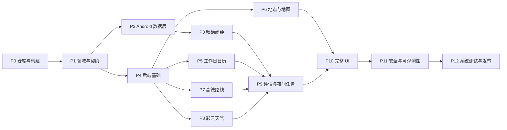

# 通勤闹钟可执行实施任务

- 对应规格：[`SPEC.md`](./SPEC.md)
- 起点：仓库中没有 Android、后端或基础设施代码
- 目标：从空项目推进到可公开发布的 Android 应用和轻量后端
- Android 包名：`com.ljwzz.weathertrafficalarm`
- 后端基础包名：`com.ljwzz.weathertrafficalarm.backend`
- 天气提供方：彩云天气 v2.6
- 路线、POI、地图和前台定位提供方：高德

## 1. 执行约定

### 1.1 任务状态

```text
[ ] 未开始
[~] 进行中
[x] 已完成
[!] 被外部条件阻塞
```

每次只将一个任务改为 `[~]`。任务完成后：

1. 执行该任务的验收命令。
2. 执行受影响模块的回归命令。
3. 在任务下记录实际结果和未验证边界。
4. 将任务改为 `[x]`。
5. 以任务 ID 创建独立提交；禁止把无关改动混入提交。

### 1.2 单任务完成定义

- 任务列出的产物均已存在。
- 验收命令退出码为 0。
- 新增行为有成功、失败和边界测试。
- 日志、fixture 和截图不包含 key、secret、令牌、地址或坐标。
- `SPEC.md`、OpenAPI 或任务清单受影响时已同步更新。
- 未使用动态依赖版本。
- 未复制无法确认许可证的第三方源码。

### 1.3 全量验证入口

在 T005 完成后统一使用：

```bash
./scripts/verify-contract.sh
./scripts/verify-backend.sh
./scripts/verify-android.sh
./scripts/verify-all.sh
```

### 1.4 主依赖关系



## 2. P0：仓库、构建和本地环境

技术基线：

- AGP 9.3 需要 Gradle 9.5.0，支持当前 `compileSdk 36`：
  https://developer.android.com/build/releases/agp-9-3-0-release-notes
- AGP 9 默认启用内置 Kotlin，不再应用 `org.jetbrains.kotlin.android`：
  https://developer.android.com/build/migrate-to-built-in-kotlin
- Kotlin 2.3.21 的 Compose 模块使用 `org.jetbrains.kotlin.plugin.compose`：
  https://developer.android.com/develop/ui/compose/setup-compose-dependencies-and-compiler
- Spring Initializr 可以生成带 wrapper 的 JVM 项目：
  https://docs.spring.io/initializr/docs/current/reference/html/

### [ ] T000 校验开发机前置工具

依赖：无。

产物：

- `docs/environment.md`
- 已记录而非猜测的 JDK、Android SDK、Docker 和 Git 版本。

实施：

1. 确认 JDK 21 可用。
2. 确认 Android SDK Platform 36、Build Tools 36.0.0、platform-tools 和 emulator 可用。
3. 确认 Docker Engine/Colima/Docker Desktop 可运行 Linux 容器。
4. 记录 macOS 架构和 Android Studio 版本。
5. 缺失工具只记录阻塞项，不把本机绝对路径写入 Gradle 文件。

验收：

```bash
java -version
git --version
adb version
docker version
test -f docs/environment.md
```

### [ ] T001 初始化 Git 和根目录文件

依赖：T000。

产物：

```text
.editorconfig
.gitattributes
.gitignore
README.md
LICENSE 或 LICENSE-TODO
NOTICE
SECURITY.md
docs/decisions/
scripts/
```

实施：

1. 初始化 Git；保留已有 `SPEC.md` 和 `IMPLEMENTATION_TASKS.md`。
2. `.gitignore` 覆盖 Android/Gradle、IntelliJ、macOS、Java、Docker、`.env` 和本地密钥文件。
3. `README.md` 写明产品名、包名、目录结构、最低工具版本和验证入口。
4. 选择许可证前确认发布目标；未确认时创建明确的 `LICENSE-TODO`，不得擅自声明许可证。
5. `SECURITY.md` 禁止提交任何生产凭证，列出私下报告渠道占位符。

验收：

```bash
git rev-parse --is-inside-work-tree
test -f .gitignore
test -f README.md
test -f SECURITY.md
git status --short
```

### [ ] T002 创建最小 Android 工程

依赖：T001。

产物：

```text
android/settings.gradle.kts
android/build.gradle.kts
android/gradle.properties
android/gradle/libs.versions.toml
android/gradlew
android/gradlew.bat
android/gradle/wrapper/
android/app/
```

实施：

1. 配置 AGP `9.3.0` 和 Gradle wrapper `9.5.0`。
2. 使用 AGP 内置 Kotlin；不得应用 `org.jetbrains.kotlin.android`。
3. Compose 模块应用 `org.jetbrains.kotlin.plugin.compose` `2.3.21`。
4. 设置 `namespace/applicationId=com.ljwzz.weathertrafficalarm`。
5. 设置 `minSdk=29`、`compileSdk=36`、`targetSdk=36`、JDK toolchain 21。
6. 添加中文应用名 `通勤闹钟`，默认应用名 `weather-traffic-alarm`。
7. 只创建能显示静态文本的单 Activity Compose 页面。
8. 开启 `buildConfig=false` 的默认策略；需要 BuildConfig 的模块后续显式开启。

验收：

```bash
cd android
./gradlew --version
./gradlew :app:assembleDebug :app:lintDebug
```

### [ ] T003 创建最小 Spring Boot 后端

依赖：T001。

产物：

```text
backend/settings.gradle.kts
backend/build.gradle.kts
backend/gradlew
backend/gradlew.bat
backend/gradle/wrapper/
backend/app/
backend/domain/
backend/provider-amap/
backend/provider-caiyun/
backend/persistence/
```

实施：

1. 使用 Spring Boot `3.5.16`、Gradle Kotlin DSL 和 JDK 21。
2. `app` 是唯一应用模块；其他模块使用 `java-library`。
3. `app` 先只依赖 Web、Validation、Actuator 和测试 starter。
4. 创建 `/actuator/health`，默认只暴露 `health` 和 `info`。
5. 测试配置使用随机端口，不依赖本机 PostgreSQL/Redis。

Spring Boot 3.5.16 Gradle 和 Actuator 配置依据：

- https://docs.spring.io/spring-boot/3.5/gradle-plugin/getting-started.html
- https://docs.spring.io/spring-boot/3.5/reference/actuator/enabling.html

验收：

```bash
cd backend
./gradlew --version
./gradlew test
./gradlew :app:bootJar
```

### [ ] T004 创建本地 PostgreSQL 和 Redis 环境

依赖：T003。

产物：

```text
infra/compose.yaml
infra/.env.example
infra/postgres/
```

实施：

1. Compose 只包含 PostgreSQL、Redis 和 healthcheck。
2. 固定镜像 digest 或明确小版本，禁止 `latest`。
3. 密码通过 `.env` 注入；仓库只提交 `.env.example`。
4. 数据卷使用项目级命名，禁止绑定用户主目录。
5. 提供 `scripts/infra-up.sh` 和 `scripts/infra-down.sh`；down 默认不删除 volume。

验收：

```bash
docker compose -f infra/compose.yaml config
docker compose -f infra/compose.yaml up -d
docker compose -f infra/compose.yaml ps
docker compose -f infra/compose.yaml down
```

### [ ] T005 创建统一验证脚本

依赖：T002、T003。

产物：

```text
scripts/verify-contract.sh
scripts/verify-android.sh
scripts/verify-backend.sh
scripts/verify-all.sh
```

实施：

1. 所有脚本启用 `set -euo pipefail`。
2. 脚本从自身位置解析仓库根目录，不依赖调用者 cwd。
3. Android 验证先执行单元测试、lint、assemble。
4. 后端验证先执行 test、check、bootJar。
5. 根脚本按 contract → backend → Android 顺序运行。
6. 任何密钥缺失只允许影响外部 Provider 集成测试，不得影响纯单元测试。

验收：

```bash
./scripts/verify-android.sh
./scripts/verify-backend.sh
./scripts/verify-all.sh
```

### [ ] T006 建立配置和密钥约定

依赖：T001。

产物：

```text
docs/configuration.md
android/local.defaults.properties
backend/app/src/main/resources/application.yml
backend/app/src/test/resources/application-test.yml
infra/secrets/README.md
```

实施：

1. 定义但不提交实际值：
   `AMAP_ANDROID_KEY`、`AMAP_WEB_KEY`、`CAIYUN_APP_KEY`、`CAIYUN_APP_SECRET`。
2. Android 正式 key 从未跟踪的 `local.properties` 或 CI secret 注入 manifest placeholder。
3. 后端 secret 只从环境变量或部署密钥挂载读取。
4. 配置启动时验证必需变量；单元测试使用 fake Provider，不要求真实凭证。
5. URL、异常和日志过滤器必须清除彩云 URL 路径中的 App Key。

验收：

```bash
rg -n 'AMAP_|CAIYUN_' docs/configuration.md android/local.defaults.properties backend/app/src/main/resources/application.yml
! rg -n '(app_secret|AMAP_WEB_KEY|CAIYUN_APP_SECRET)\\s*[:=]\\s*[^$<{]' --glob '!SPEC.md' --glob '!IMPLEMENTATION_TASKS.md' .
```

### [ ] T007 创建 OpenAPI 3.1 骨架

依赖：T001。

产物：

```text
contract/openapi.yaml
contract/examples/
contract/README.md
```

实施：

1. 添加服务器占位符、统一错误模型和 correlation ID。
2. 先声明四个路径：
   `/v1/installations/attest`、`/v1/calendars/CN/{year}`、
   `/v1/places/search`、`/v1/alarm-evaluations`。
3. 所有请求对象设置 `additionalProperties: false`。
4. 日期时间统一 RFC 3339，时区字段使用 IANA zone ID 字符串。
5. 坐标字段明确顺序、范围和 `coordinateSystem`。
6. 添加最小成功/失败 example。

验收：

```bash
test -f contract/openapi.yaml
rg -n 'openapi: 3\\.1|/v1/alarm-evaluations|additionalProperties: false' contract/openapi.yaml
```

### [ ] T008 锁定依赖和校验构建输入

依赖：T002、T003。

产物：

```text
android/**/gradle.lockfile
backend/**/gradle.lockfile
android/gradle/verification-metadata.xml
backend/gradle/verification-metadata.xml
```

实施：

1. Android 使用 version catalog。
2. 两个 Gradle build 启用 dependency locking。
3. 生成依赖校验 metadata，禁止未审查 checksum 自动更新。
4. 检查不存在 `+`、`latest.*`、`SNAPSHOT`。
5. 记录所有非 Apache/MIT/BSD 许可证依赖，进入发布前人工复核。

Gradle dependency locking 依据：

- https://docs.gradle.org/current/userguide/dependency_locking.html

验收：

```bash
! rg -n '(latest\\.|\\+\"|SNAPSHOT)' android backend
cd android && ./gradlew dependencies --write-locks
cd ../backend && ./gradlew dependencies --write-locks
```

### [ ] T009 建立首个绿色基线

依赖：T005、T007、T008。

产物：

- Android debug APK。
- 后端 bootJar。
- 首份 `docs/build-baseline.md`。

实施：

1. 从干净工作区执行全部验证。
2. 记录耗时、JDK、Gradle、AGP 和失败重试情况。
3. 确认构建不需要生产 secret。
4. 为后续任务建立基线提交。

验收：

```bash
./scripts/verify-all.sh
test -f android/app/build/outputs/apk/debug/app-debug.apk
test -n "$(find backend/app/build/libs -name '*.jar' -print -quit)"
git status --short
```

## 3. P1：模块、领域规则和 API 契约

### [ ] T010 创建 Android 模块骨架和依赖边界

依赖：T009。

产物：

```text
android/core/model/
android/core/data/
android/core/network/
android/core/alarm/
android/core/map/
android/feature/onboarding/
android/feature/home/
android/feature/plan/
android/feature/place/
android/feature/calendar/
android/feature/history/
android/feature/diagnostics/
```

实施：

1. `core:model` 使用 Android library，但禁止 Android UI、Room、Retrofit和 Provider DTO。
2. feature 模块不能相互依赖。
3. `app` 只负责 composition root、导航和 manifest 汇总。
4. 先给每个模块添加空测试，确保独立编译。

验收：

```bash
cd android
./gradlew projects
./gradlew testDebugUnitTest
```

### [ ] T011 实现基础领域类型

依赖：T010。

产物：

- Android `core:model` 中的 `AlarmPlan`、`PlaceRef`、`AlarmDecision`、`AlarmOccurrence`。
- 后端 `domain` 中与契约对应的路线、天气、日历和评估领域类型。
- 两端一致的 `CommuteMode`、`WeatherSeverity` 和 `FallbackReason` 名称。

实施：

1. 按 `SPEC.md` 分别建模；不建立 Android/后端共享二进制模块。
2. 时间使用 `Instant`、`LocalDate`、`LocalTime`、`ZoneId`，不使用裸毫秒。
3. `PlaceRef` 显式保存 `coordinateSystem`，首版只允许 `GCJ02`。
4. 在构造边界校验分钟、经纬度和非空字段。
5. Provider 名称只作为值对象，不让外部 DTO 进入领域层。
6. 跨端一致性由 OpenAPI 和共享 JSON 测试向量保证。

验收：

```bash
cd android
./gradlew :core:model:testDebugUnitTest
cd ../backend
./gradlew :domain:test
```

### [ ] T012 实现工作日引擎

依赖：T011。

产物：

- Android 和后端各自的 `WorkdayResolver`。
- `contract/examples/workday-cases.json` 共享测试向量。

实施：

1. 严格执行用户覆盖 > 官方年度数据 > 周规则。
2. 支持跨年查找下一工作日。
3. 对缺失年度、签名失败和过期数据返回可解释来源。
4. 对查找设置有限上界，避免损坏数据导致无限循环。
5. 两端必须通过同一组共享测试向量。

验收：

```bash
cd android
./gradlew :core:model:testDebugUnitTest --tests '*WorkdayResolverTest'
cd ../backend
./gradlew :domain:test --tests '*WorkdayResolverTest'
```

### [ ] T013 实现闹钟纯计算函数

依赖：T011。

产物：

- Android 和后端各自的 `AlarmTimeCalculator`。
- `contract/examples/alarm-calculation-cases.json` 共享测试向量。

实施：

1. 实现默认时间、最大提前、准备时长、天气缓冲和路线出发时间计算。
2. 实现同一 occurrence 只允许提前的不变量。
3. 新 plan revision 允许用户主动推迟。
4. 覆盖跨日、跨时区、夏令时 gap/overlap 和极值。
5. 纯函数不得访问 Android、数据库、网络或系统时钟。
6. 两端必须对同一输入产生同一时间结果和 fallback。

验收：

```bash
cd android
./gradlew :core:model:testDebugUnitTest --tests '*AlarmTimeCalculatorTest'
cd ../backend
./gradlew :domain:test --tests '*AlarmTimeCalculatorTest'
```

### [ ] T014 定义路线和天气领域端口

依赖：T011。

产物：

- 后端 `domain` 中的 `RouteProvider`、`WeatherProvider`。
- `RouteEstimate`、`WeatherEstimate`、`EvaluationClock`。

实施：

1. 端口只使用领域类型。
2. `WeatherEstimate` 包含规则版本、数据时间、窗口、严重等级和 fallback。
3. `RouteEstimate` 包含模式、出发/到达、耗时、Provider 和 fallback。
4. 错误分为超时、鉴权、配额、无结果、不可用和协议错误。
5. 为每个端口提供 fake 实现。

验收：

```bash
cd backend
./gradlew :domain:test
```

### [ ] T015 定义天气严重等级规则契约

依赖：T011。

产物：

- `contract/weather-rules/v1.json`。
- 彩云 `skycon` 全枚举、数值边界和期望等级测试向量。
- `weatherRuleVersion=v1` 的字段说明。

实施：

1. 使用 `skycon`、降水概率/强度、风速和能见度。
2. 不解析 `description` 或 `forecast_keypoint`。
3. 未知代码返回 `WEATHER_UNKNOWN_CODE`，不得按晴天处理。
4. 在时间窗口和两地点之间取最高等级。
5. 预警信息只能上调等级，不能降低。
6. 常规 v2.6 `skycon` 没有独立冻雨代码；不得用温度和降水自行推断冻雨。
7. 本任务只固定跨模块契约；实际 Provider 分类器在 T095 实现。

彩云字段和天气现象依据：

- https://docs.caiyunapp.com/weather-api/v2/v2.6/3-hourly.html
- https://docs.caiyunapp.com/weather-api/v2/v2.6/tables/skycon.html
- https://docs.caiyunapp.com/weather-api/v2/v2.6/tables/precip.html

验收：

```bash
./scripts/verify-contract.sh
rg -n 'weatherRuleVersion|UNKNOWN|STORM_RAIN|STORM_SNOW' contract/weather-rules/v1.json
```

### [ ] T016 定义评估编排器

依赖：T012、T013、T014、T015。

产物：

- 后端 `AlarmEvaluationService` 领域接口及 fake Provider 实现。
- 决策步骤测试。

实施：

1. 验证目标日期是否为工作日。
2. 并行获取起点/终点天气，路线按模式调用对应 Provider。
3. 合并结果并执行只提前计算。
4. 任一 Provider 失败时返回明确 fallback，不取消基础闹钟。
5. 决策包含输入 plan revision 和过期时间。

验收：

```bash
cd backend
./gradlew :domain:test --tests '*AlarmEvaluationServiceTest'
```

### [ ] T017 完整化 OpenAPI schema

依赖：T007、T011、T014。

产物：

- 四个端点的完整 schema。
- 所有 enum、约束、examples 和错误响应。

实施：

1. 与 `SPEC.md` 第 7 节逐字段对齐。
2. 分离 `routeProvider*` 与 `weatherProvider*` 字段。
3. 响应包含 `weatherWindowStart` 和 `weatherWindowEnd`。
4. 坐标对象包含 `coordinateSystem=GCJ02`。
5. `weatherRuleVersion` 在请求和响应中必填。
6. 所有 Provider 错误使用稳定机器码，不把上游正文透传给客户端。
7. 添加向后兼容检查基线。

验收：

```bash
./scripts/verify-contract.sh
rg -n 'weatherProviderReportTime|coordinateSystem|WEATHER_UNKNOWN_CODE' contract/openapi.yaml
```

### [ ] T018 配置 OpenAPI 代码生成

依赖：T017、T002、T003。

产物：

- Android Retrofit/Kotlin Serialization 生成任务。
- Spring 接口/DTO 生成任务。
- 生成目录和禁止手改说明。

实施：

1. 锁定 OpenAPI Generator 版本和模板。
2. 生成代码放入 build 目录，不提交无法稳定复现的临时文件。
3. 生成代码只负责传输类型，不承载领域规则。
4. 用 mapper 隔离生成 DTO 和领域模型。
5. CI 重新生成并比较稳定产物。

生成器能力依据：

- https://openapi-generator.tech/docs/generators/kotlin/
- https://openapi-generator.tech/docs/generators/spring/

验收：

```bash
./scripts/verify-contract.sh
cd android && ./gradlew openApiGenerate
cd ../backend && ./gradlew openApiGenerate
```

### [ ] T019 建立契约 examples 和 MockWebServer fixtures

依赖：T018。

产物：

```text
contract/examples/*.json
android/core/network/src/test/resources/
backend/app/src/test/resources/contracts/
```

实施：

1. 每个端点至少提供成功、校验失败、可重试失败和不可重试失败。
2. fixture 使用虚构坐标和令牌。
3. Android 反序列化所有响应 example。
4. 后端序列化结果必须通过同一 schema。
5. 加入未知 enum 和新增字段的兼容性测试。

验收：

```bash
./scripts/verify-contract.sh
cd android && ./gradlew :core:network:testDebugUnitTest
cd ../backend && ./gradlew :app:test
```

## 4. P2：Android 数据、网络和依赖注入

### [ ] T020 配置 Hilt 和 KSP

依赖：T010。

产物：

- `CommuteAlarmApplication`。
- Hilt application component。
- KSP 配置。

实施：

1. 使用 KSP，不使用 kapt。
2. 添加 Hilt `2.60.1` 和 AndroidX Hilt `1.3.0`。
3. `Application` 标记 `@HiltAndroidApp`，Activity 标记 `@AndroidEntryPoint`。
4. 每个 core 模块只暴露最少 binding。
5. 测试使用 fake module 替换外部端口。

Hilt/KSP 依据：

- https://dagger.dev/hilt/gradle-setup.html
- https://developer.android.com/build/migrate-to-ksp

验收：

```bash
cd android
./gradlew :app:assembleDebug :app:testDebugUnitTest
```

### [ ] T021 定义 Room schema 和 DAO

依赖：T011、T020。

产物：

- `AlarmPlanEntity`、`PlaceEntity`、`WorkdayOverrideEntity`。
- `AlarmDecisionEntity`、`AlarmOccurrenceEntity`。
- DAO、converter 和 schema export。

实施：

1. Room 只保存在凭据加密/设备保护边界之外允许的数据。
2. plan 保存、revision 更新和 occurrence 创建使用事务。
3. 决策历史限制 30 天，提供定期清理 DAO。
4. 坐标列不得出现在调试日志的自动 `toString`。
5. 启用 schema export。

验收：

```bash
cd android
./gradlew :core:data:kspDebugKotlin :core:data:testDebugUnitTest
test -n "$(find core/data/schemas -type f -print -quit)"
```

### [ ] T022 建立 Room 迁移测试基线

依赖：T021。

产物：

- 数据库 v1 schema。
- `MigrationTestHelper` 测试。

实施：

1. 保存 v1 schema 为受版本控制资产。
2. 创建空迁移测试，验证 v1 能创建、打开和写入。
3. 禁止生产配置使用 destructive migration。
4. 后续每次 schema 变更必须新增迁移任务。

Room 迁移测试依据：

- https://developer.android.com/training/data-storage/room/migrating-db-versions

验收：

```bash
cd android
./gradlew :core:data:connectedDebugAndroidTest
```

### [ ] T023 实现偏好 Proto DataStore

依赖：T020。

产物：

- 隐私同意、天气缓冲、诊断开关等 typed preferences。
- corruption handler 和迁移测试。

实施：

1. 禁止使用字符串 key Preferences DataStore 保存领域配置。
2. schema 字段只追加，不复用已删除字段编号。
3. 默认值与 `SPEC.md` 一致。
4. 腐坏时只重建非关键偏好，不删除 Room 计划。

验收：

```bash
cd android
./gradlew :core:data:testDebugUnitTest --tests '*PreferencesStoreTest'
```

### [ ] T024 实现设备保护存储的下一闹钟快照

依赖：T020、T021。

产物：

- `NextAlarmSnapshotStore`。
- device-protected DataStore。
- 多计划快照测试。

实施：

1. 使用 device-protected context。
2. 只保存 occurrence、触发时间、声音、振动和贪睡字段。
3. 禁止保存地点、地址、token 或完整计划。
4. 写入使用原子更新，支持 0..N 个计划快照。
5. 用户解锁后与 Room revision 对账。

Direct Boot 依据：

- https://developer.android.com/privacy-and-security/direct-boot

验收：

```bash
cd android
./gradlew :core:alarm:testDebugUnitTest --tests '*NextAlarmSnapshotStoreTest'
```

### [ ] T025 实现 repository 和事务用例

依赖：T021、T023、T024。

产物：

- `AlarmPlanRepository`、`DecisionRepository`、`OccurrenceRepository`。
- 保存、启用、禁用、删除和覆盖日期用例。

实施：

1. repository 对 feature 层只暴露领域类型和 Flow。
2. 修改调度字段时递增 revision。
3. 禁用/删除计划同时标记 occurrence 待取消。
4. 单元测试验证事务失败时不产生半状态。

验收：

```bash
cd android
./gradlew :core:data:testDebugUnitTest
```

### [ ] T026 实现后端 API 客户端

依赖：T018、T020。

产物：

- Retrofit API、Kotlin Serialization、OkHttp client。
- 超时、错误 mapper 和 fake transport。

实施：

1. Base URL 由 build config 注入，release 禁止 HTTP。
2. 连接、读取、写入和总调用超时分别配置。
3. 只对幂等或带 request ID 的调用执行有限重试。
4. 不安装 release body logger。
5. 把 HTTP、协议和领域失败分开映射。

验收：

```bash
cd android
./gradlew :core:network:testDebugUnitTest
```

### [ ] T027 实现客户端日志脱敏

依赖：T026。

产物：

- `RedactingEventLogger`。
- token、地址、POI、坐标、URI 脱敏测试。

实施：

1. 使用字段白名单记录事件，不对任意对象调用 `toString()`。
2. 网络异常只记录 host、path 模板、状态码和 correlation ID。
3. release 禁止原始请求/响应和堆栈中的 URL query/path secret。
4. 为彩云、高德和安装令牌添加专门规则。

验收：

```bash
cd android
./gradlew :core:network:testDebugUnitTest --tests '*RedactingEventLoggerTest'
```

## 5. P3：基础精确闹钟和离线可靠性

精确闹钟、PendingIntent、Direct Boot 和前台服务依据：

- https://developer.android.com/develop/background-work/services/alarms
- https://developer.android.com/reference/android/app/PendingIntent
- https://developer.android.com/privacy-and-security/risks/pending-intent
- https://developer.android.com/develop/background-work/services/fgs/service-types
- https://developer.android.com/develop/background-work/services/fgs/restrictions-bg-start

### [ ] T030 实现计划启用前能力诊断

依赖：T025。

产物：

- `AlarmCapabilityChecker`。
- 通知、精确闹钟、全屏 Intent、渠道和音量状态模型。

实施：

1. 每次回到前台和启用计划前刷新。
2. 区分阻塞能力和可降级能力。
3. 精确闹钟或通知不可用时阻止启用。
4. 全屏能力不可用时允许启用，但显示降级说明。
5. 为每项能力提供系统设置 Intent；设置 Intent 不可解析时显示手工步骤。

验收：

```bash
cd android
./gradlew :core:alarm:testDebugUnitTest --tests '*AlarmCapabilityCheckerTest'
```

### [ ] T031 实现 occurrence 状态机

依赖：T025。

产物：

- occurrence 合法转换表。
- 幂等 transition API。

实施：

1. 只允许 `DEFAULT_REGISTERED → ADVANCED/FIRING/CANCELLED` 等规格转换。
2. 重复停止、贪睡或广播返回已完成结果。
3. plan revision 不匹配时拒绝旧 occurrence。
4. 为所有非法转换编写测试。

验收：

```bash
cd android
./gradlew :core:alarm:testDebugUnitTest --tests '*OccurrenceStateMachineTest'
```

### [ ] T032 实现唯一 PendingIntent 工厂

依赖：T031。

产物：

- alarm、stop、snooze 和 full-screen PendingIntent factory。

实施：

1. Intent 显式指定组件。
2. 使用 `FLAG_IMMUTABLE`；一次性操作按需使用 `FLAG_ONE_SHOT`。
3. data URI 和 request code 都包含稳定 occurrence 身份。
4. extras 只携带冗余校验字段，不参与身份设计。
5. 测试两个 occurrence 不会互相覆盖。

验收：

```bash
cd android
./gradlew :core:alarm:testDebugUnitTest --tests '*PendingIntentFactoryTest'
```

### [ ] T033 实现默认闹钟调度器

依赖：T012、T024、T031、T032。

产物：

- `ExactAlarmScheduler`。
- `setAlarmClock()` adapter。

实施：

1. 保存/启用计划后先创建默认 occurrence。
2. 先持久化快照，再注册系统闹钟，再提交状态。
3. 注册失败时保留可诊断状态并回滚错误快照。
4. 每个启用计划最多保有一个非贪睡的下一 occurrence。
5. 禁用和删除时精确取消对应 PendingIntent。

验收：

```bash
cd android
./gradlew :core:alarm:testDebugUnitTest --tests '*ExactAlarmSchedulerTest'
./gradlew :app:assembleDebug
```

### [ ] T034 声明 Receiver、Service 和权限

依赖：T030、T033。

产物：

- AndroidManifest 中的权限、receiver、service 和 activity 声明。

实施：

1. 声明 `USE_EXACT_ALARM`、通知、全屏、重启、wake lock、振动和 FGS 权限。
2. `AlarmReceiver`、动作 receiver 和 ringing service 均 `exported=false`。
3. boot receiver `directBootAware=true`。
4. ringing service 使用 `foregroundServiceType=systemExempted`。
5. 运行 lint，确认没有 exported/permission 错误。

验收：

```bash
cd android
./gradlew :app:processDebugMainManifest :app:lintDebug
```

### [ ] T035 实现 AlarmReceiver 校验

依赖：T031、T032、T034。

产物：

- `AlarmReceiver`。
- 过期、伪造、重复和时间窗口测试。

实施：

1. 不进行网络和数据库长事务。
2. 校验 occurrence ID、plan revision、状态和触发窗口。
3. 合法时使用 `startForegroundService()` 启动 ringing service。
4. 捕获后台启动限制异常并记录诊断，不崩溃。
5. 过期广播只重建下一 occurrence。

验收：

```bash
cd android
./gradlew :core:alarm:testDebugUnitTest --tests '*AlarmReceiverTest'
```

### [ ] T036 实现响铃音频和振动

依赖：T034、T035。

产物：

- `AlarmSoundPlayer`、`AlarmVibrator`。
- 自定义 URI 回退链。

实施：

1. 使用 `RingtoneManager.TYPE_ALARM` 和 `AudioAttributes.USAGE_ALARM`。
2. 自定义 URI 失败时回退到系统 alarm、notification、内置声音。
3. API 29+ 启用循环。
4. 停止必须释放 Ringtone 和振动。
5. 记录错误类型，不记录铃声 URI。

平台音频依据：

- https://developer.android.com/reference/android/media/RingtoneManager
- https://developer.android.com/reference/android/media/Ringtone
- https://developer.android.com/reference/android/media/AudioAttributes

验收：

```bash
cd android
./gradlew :core:alarm:testDebugUnitTest --tests '*AlarmSoundPlayerTest'
```

### [ ] T037 实现响铃前台服务和通知

依赖：T034、T036。

产物：

- `AlarmRingingService`。
- `alarm_ringing` 高优先级渠道。
- 停止、贪睡和全屏通知。

实施：

1. 服务启动后立即调用兼容的 `startForeground`。
2. API 34+ 使用 `FOREGROUND_SERVICE_TYPE_SYSTEM_EXEMPTED`。
3. 通知展示计划名、时间和动作。
4. 全屏 Intent 仅在 occurrence 正在响铃时设置。
5. 服务被系统重建但无合法 occurrence 时立即停止。

验收：

```bash
cd android
./gradlew :app:assembleDebug :app:lintDebug
```

### [ ] T038 实现停止和贪睡

依赖：T031、T032、T037。

产物：

- `DismissAlarmUseCase`。
- `SnoozeAlarmUseCase`。

实施：

1. 停止更新状态、停止 service、取消通知并安排计划下一次 occurrence。
2. 贪睡创建新 occurrence，默认 10 分钟，仍使用 `setAlarmClock()`。
3. 连续点击和重复广播幂等。
4. 贪睡不修改 plan revision。
5. 多计划同分钟互不影响。

验收：

```bash
cd android
./gradlew :core:alarm:testDebugUnitTest --tests '*DismissAlarmUseCaseTest' --tests '*SnoozeAlarmUseCaseTest'
```

### [ ] T039 实现自动提前的原子替换

依赖：T013、T033。

产物：

- `AdvanceOccurrenceUseCase`。
- 旧闹钟保留/替换失败测试。

实施：

1. 只接受更早时间和当前 revision。
2. 先注册新 occurrence，再取消旧 PendingIntent。
3. 新注册失败时保留旧基础闹钟。
4. 成功后原子更新 Room 和 Direct Boot 快照。
5. 同一 decision 重复到达不重复注册。

验收：

```bash
cd android
./gradlew :core:alarm:testDebugUnitTest --tests '*AdvanceOccurrenceUseCaseTest'
```

### [ ] T040 实现启动、重启和时间变化恢复

依赖：T024、T033、T035。

产物：

- locked boot、boot、time、timezone、locale、package replaced receivers。
- 恢复协调器。

实施：

1. locked boot 只读取 device-protected 快照。
2. 解锁后从 Room 完整对账。
3. 时间越过触发点 10 分钟内立即响铃，超过则标记 missed。
4. 时区和系统时间改变后取消并重建下一 occurrence。
5. 应用前台启动时检测强制停止后丢失的调度。

验收：

```bash
cd android
./gradlew :core:alarm:testDebugUnitTest --tests '*AlarmRecoveryCoordinatorTest'
./gradlew :app:lintDebug
```

### [ ] T041 建立基础闹钟设备验收

依赖：T030–T040。

产物：

- `docs/test-results/basic-alarm.md`。
- API 29、33、36 的测试记录。

实施：

1. 安装 debug APK，创建一个 2 分钟后的测试计划。
2. 验证系统下一闹钟、锁屏响铃、停止和贪睡。
3. 验证进程被杀、Doze 和无网。
4. 验证重启后未解锁恢复。
5. 保存命令和结果，不保存包含地点的截图。

验收：

```bash
adb shell dumpsys alarm
adb shell dumpsys deviceidle force-idle
test -f docs/test-results/basic-alarm.md
```

## 6. P4：后端基础能力

### [ ] T050 配置后端模块依赖

依赖：T003、T018。

产物：

- `app → domain`。
- `app → provider-amap/provider-caiyun/persistence`。
- Provider 模块只依赖 domain 端口。

实施：

1. domain 不依赖 Spring Web、JDBC、Redis 或 Provider DTO。
2. app 装配 Spring bean 和 generated API。
3. persistence 使用 Spring JDBC 或 Spring Data JDBC；首版不同时引入 JPA。
4. Provider 模块各自拥有 HTTP client 和 DTO。

验收：

```bash
cd backend
./gradlew projects dependencies test
```

### [ ] T051 配置环境和类型安全属性

依赖：T006、T050。

产物：

- `@ConfigurationProperties`：数据库、Redis、高德、彩云、限流和超时。
- local/test/prod profile。

实施：

1. 配置类使用 Bean Validation。
2. prod 缺少 secret 时启动失败。
3. test 使用 fake Provider，不读取真实环境变量。
4. Actuator `/env` 不对外暴露。
5. 错误信息不得回显 secret 值。

验收：

```bash
cd backend
./gradlew :app:test --tests '*ConfigurationPropertiesTest'
```

### [ ] T052 接入 PostgreSQL 和 Flyway

依赖：T004、T050。

产物：

- datasource。
- Flyway V1 migration。
- 安装令牌、日历 metadata 和配额审计表。

实施：

1. 不创建地点、地址或完整评估请求表。
2. migration 可前滚，不在启动时自动修复 checksum。
3. 使用 Testcontainers 验证全新库和重复启动。
4. 为时间、token hash 和版本字段建必要索引。

验收：

```bash
cd backend
./gradlew :persistence:test --tests '*MigrationTest'
```

### [ ] T053 接入 Redis

依赖：T004、T050。

产物：

- 高德路线/POI、彩云天气缓存 namespace。
- 限流 namespace。

实施：

1. cache key 使用服务端 HMAC 摘要，不包含明文坐标、地址或 query。
2. 不同 Provider、操作、版本和坐标系隔离。
3. 缓存值只保存完成决策所需的最小上游数据。
4. Redis 不可用时退化为无缓存，不影响基础服务启动。

验收：

```bash
cd backend
./gradlew :persistence:test --tests '*Redis*Test'
```

### [ ] T054 实现安装令牌

依赖：T052。

产物：

- `/v1/installations/attest`。
- 短期签名安装令牌。
- 匿名低配额分支。

实施：

1. 首版允许无 Play Integrity 的匿名令牌。
2. 数据库只保存 installation ID 的不可逆摘要和最小审计字段。
3. 令牌包含 tier、issuedAt、expiresAt 和随机 ID。
4. 密钥支持轮换和双 key 验证窗口。
5. 闹钟基础功能不依赖令牌获取成功。

验收：

```bash
cd backend
./gradlew :app:test --tests '*InstallationAttestation*Test'
```

### [ ] T055 实现 Bucket4j 分布式限流

依赖：T053、T054。

产物：

- installation token、IP、endpoint、Provider 四层限流。
- `429` 标准错误。

实施：

1. 使用 Redis/Lettuce 后端。
2. 匿名 tier 配额低于已验证 tier。
3. 返回 `Retry-After`。
4. Redis 故障策略按端点区分：计算接口 fail-closed，健康检查不受影响。
5. 指标只包含 tier/endpoint，不包含 token/IP。

Bucket4j 依据：

- https://github.com/bucket4j/bucket4j

验收：

```bash
cd backend
./gradlew :app:test --tests '*RateLimit*Test'
```

### [ ] T056 建立 Provider 容错策略

依赖：T050。

产物：

- 高德路线、POI和彩云天气的独立 timeout、retry、circuit breaker 和 bulkhead。

实施：

1. 只重试连接失败、超时和明确可重试上游状态。
2. 鉴权、参数和配额错误不盲目重试。
3. 重试总时间必须小于接口服务端 deadline。
4. 每个 Provider 独立线程/并发舱壁。
5. fallback 转换为稳定领域错误。

Resilience4j Spring Boot 3 依据：

- https://resilience4j.readme.io/docs/getting-started-3

验收：

```bash
cd backend
./gradlew :app:test --tests '*ProviderResilience*Test'
```

### [ ] T057 实现 API 校验和统一错误处理

依赖：T017、T050。

产物：

- generated API 实现骨架。
- validation、error mapper、correlation ID filter。

实施：

1. 所有外部输入在 controller 边界校验。
2. 不把堆栈或上游响应暴露给客户端。
3. correlation ID 无效时生成新 UUID。
4. HTTP 状态和 `retryable` 语义一致。
5. 未实现 Provider 时返回受控 `503`，不返回空成功。

验收：

```bash
cd backend
./gradlew :app:test --tests '*ApiErrorHandlerTest'
```

### [ ] T058 配置 Actuator、Micrometer 和追踪

依赖：T050、T056。

产物：

- health/readiness/liveness。
- HTTP、Provider、缓存、限流和 fallback 指标。
- OpenTelemetry agent 配置文档。

实施：

1. 指标 label 使用有限 enum。
2. 禁止把坐标、地址、query、token、planId 放入 label/span。
3. readiness 检查数据库和 Redis；外部 Provider 故障仅降级，不使实例不健康。
4. 生产只开放必要 Actuator 端点。

依据：

- https://docs.spring.io/spring-boot/reference/actuator/metrics.html
- https://opentelemetry.io/docs/zero-code/java/spring-boot-starter/

验收：

```bash
cd backend
./gradlew :app:test --tests '*Observability*Test'
```

### [ ] T059 创建后端容器镜像

依赖：T052–T058。

产物：

- 多阶段 `backend/Dockerfile`。
- 非 root 运行用户。
- healthcheck 和 `.dockerignore`。

实施：

1. 构建阶段使用锁定 JDK 镜像，运行阶段使用锁定 JRE 镜像。
2. 镜像不复制 Gradle cache、测试报告或 secret。
3. 以非 root 用户运行，只开放应用端口。
4. 支持只读 root filesystem 和临时目录挂载。

验收：

```bash
docker build -t weather-traffic-alarm-backend:test backend
docker inspect weather-traffic-alarm-backend:test
```

## 7. P5：官方工作日日历

### [ ] T060 定义年度日历源格式

依赖：T012、T050。

产物：

```text
calendar-data/sources/CN/2026/source.yaml
calendar-data/generated/CN/2026/calendar.json
calendar-data/schema/calendar.schema.json
```

实施：

1. 保存官方来源 URL、发布时间和人工复核人。
2. 每日状态显式列出，禁止从自然语言在运行时动态解析。
3. 生成 JSON 使用确定排序和规范化编码。
4. 2026 数据逐项对照国务院通知。

官方来源：

- https://big5.www.gov.cn/gate/big5/www.gov.cn/zhengce/zhengceku/202511/content_7047091.htm

验收：

```bash
test -f calendar-data/generated/CN/2026/calendar.json
./backend/gradlew -p backend :domain:test --tests '*CalendarFixtureTest'
```

### [ ] T061 实现日历生成和校验工具

依赖：T060。

产物：

- 构建期日历生成器。
- 重复日期、缺失日期和非法状态校验。

实施：

1. 同一输入生成字节级一致 JSON。
2. 检查全年日期连续、闰年和跨年边界。
3. 检查周末调班与假日集合无冲突。
4. 输出 SHA-256。

验收：

```bash
./backend/gradlew -p backend :domain:test --tests '*CalendarGeneratorTest'
```

### [ ] T062 实现 Tink 日历签名

依赖：T061。

产物：

- 后端签名 CLI。
- Android 内置公钥 fixture。
- 签名、验签和篡改测试。

实施：

1. 私钥仅从外部 keyset/secret 读取。
2. 签名对象是规范化 payload 字节，不包含 signature 字段。
3. Android 只包含公钥。
4. 支持 `keyId` 和至少一个旧公钥的轮换窗口。

Tink Digital Signature 依据：

- https://developers.google.com/tink/digital-signature
- https://developers.google.com/tink/setup/java

验收：

```bash
cd backend
./gradlew :domain:test --tests '*CalendarSignatureTest'
cd ../android
./gradlew :core:data:testDebugUnitTest --tests '*CalendarSignatureVerifierTest'
```

### [ ] T063 实现日历查询 API

依赖：T052、T057、T062。

产物：

- `GET /v1/calendars/CN/{year}`。
- ETag 和 `If-None-Match`。

实施：

1. 只发布已签名、已复核版本。
2. 同年版本单调递增。
3. 返回来源 URL、hash、签名、key ID 和日期列表。
4. 不存在年度返回标准 `404 CALENDAR_NOT_FOUND`。

验收：

```bash
cd backend
./gradlew :app:test --tests '*CalendarApiTest'
```

### [ ] T064 实现 Android 日历同步

依赖：T023、T025、T063。

产物：

- 内置当年日历。
- `CalendarSyncRepository`。
- ETag 缓存和验签。

实施：

1. 先验签再写入有效版本。
2. 新版本失败时保留当前版本。
3. 离线首次启动使用内置日历。
4. 同步不影响已注册基础闹钟。

验收：

```bash
cd android
./gradlew :core:data:testDebugUnitTest --tests '*CalendarSyncRepositoryTest'
```

### [ ] T065 实现用户单日覆盖

依赖：T025、T064。

产物：

- 创建、修改、删除覆盖的用例。
- 覆盖变更后的 occurrence 重算。

实施：

1. 覆盖绑定 plan，不全局污染其他计划。
2. 用户覆盖优先于官方数据。
3. 删除覆盖恢复官方/周规则。
4. 变更影响下一日期时立即重调度。

验收：

```bash
cd android
./gradlew :core:data:testDebugUnitTest --tests '*WorkdayOverrideUseCaseTest'
```

## 8. P6：地点、高德地图和前台定位

### [ ] T070 实现高德隐私初始化闸门

依赖：T023、T020。

产物：

- `AmapPrivacyGate`。
- 同意前零初始化测试。

实施：

1. 用户同意前不得创建 MapView、定位或搜索对象。
2. 同意后先调用 `updatePrivacyShow` 和 `updatePrivacyAgree`。
3. 撤回同意后停止定位并禁止新建 SDK 对象。
4. debug 网络测试验证首次同意前无高德请求。

依据：

- https://lbs.amap.com/api/compliance-center/check-and-reference/sdkhgsy
- https://lbs.amap.com/api/android-location-sdk/guide/create-project/dev-attention

验收：

```bash
cd android
./gradlew :core:map:testDebugUnitTest --tests '*AmapPrivacyGateTest'
```

### [ ] T071 接入高德 Android SDK

依赖：T006、T070。

产物：

- SDK 依赖、manifest placeholder、release keep rules。

实施：

1. 使用规格锁定的合包版本。
2. key 只从本地/CI 配置注入。
3. release APK 扫描不得包含 Web API key。
4. 在真机确认 SDK 加载和许可证信息。

验收：

```bash
cd android
./gradlew :app:assembleDebug :app:lintDebug
```

### [ ] T072 实现 Compose MapView 适配

依赖：T071。

产物：

- `AmapView` composable。
- 生命周期适配和单点 marker。

实施：

1. 使用 `AndroidView` 包装官方 MapView。
2. 转发 create/resume/pause/save/destroy。
3. 重组不重复创建地图实例。
4. 页面退出后释放 listener 和 location source。

`AndroidView` 依据：

- https://developer.android.com/develop/ui/compose/migrate/interoperability-apis/views-in-compose

验收：

```bash
cd android
./gradlew :core:map:testDebugUnitTest :app:assembleDebug
```

### [ ] T073 实现用户触发的前台定位

依赖：T070、T071。

产物：

- “使用当前位置”用例。
- coarse/fine permission 状态和拒绝路径。

实施：

1. 只有点击按钮才请求权限和单次定位。
2. 不声明 `ACCESS_BACKGROUND_LOCATION`。
3. 超时或拒绝时返回地图选点，不阻塞计划创建。
4. 定位结束立即停止 client。

验收：

```bash
cd android
./gradlew :core:map:testDebugUnitTest --tests '*CurrentLocationUseCaseTest'
./gradlew :app:lintDebug
```

### [ ] T074 实现后端高德 POI 搜索

依赖：T051、T056、T057。

产物：

- `/v1/places/search`。
- 高德 POI adapter、缓存和限流。

实施：

1. Web key 只在后端。
2. query、city 和分页边界按 OpenAPI 校验。
3. 上游 DTO 映射为统一 `PlaceRef`。
4. 原始 query、地址和坐标不写日志。
5. 上游错误映射为稳定 code。

验收：

```bash
cd backend
./gradlew :provider-amap:test :app:test --tests '*PlaceSearchApiTest'
```

### [ ] T075 实现 Android 地点搜索和选点

依赖：T026、T072、T073、T074。

产物：

- 搜索、分页、地图点选和确认流程。

实施：

1. 搜索输入防抖，但不在本地日志记录内容。
2. 选择 POI 后允许用户在地图微调。
3. 保存前展示名称和地址，不展示原始坐标。
4. origin/destination 均复用同一组件。

验收：

```bash
cd android
./gradlew :feature:place:testDebugUnitTest :app:assembleDebug
```

### [ ] T076 关闭彩云输入坐标系门禁

依赖：T074、T075。

产物：

- `docs/provider/caiyun-coordinate-system.md`。
- 至少 5 个已知控制点对照结果。
- 明确的 `CoordinateNormalizer` 策略。

实施：

1. 向彩云获取 v2.6 常规天气接口输入坐标基准的书面确认；或使用已知边界控制点验证。
2. 分别用高德 GCJ-02 和转换后的候选坐标查询，比较返回 location/天气栅格归属。
3. 未得到可靠结论时保持 `[!]`，不得启用生产彩云 Provider。
4. 将最终坐标策略写入契约和 adapter 测试。

彩云现有 FAQ 只明确其 App 使用 GCJ-02，无法单独证明一般 v2.6 API 输入坐标基准：

- https://docs.caiyunapp.com/weather-api/q.html

验收：

```bash
test -f docs/provider/caiyun-coordinate-system.md
rg -n '结论|证据|控制点|GCJ' docs/provider/caiyun-coordinate-system.md
```

## 9. P7：高德路线 Provider

### [ ] T080 建立高德 Web API 客户端

依赖：T051、T056。

产物：

- 脱敏 HTTP client、上游错误 mapper 和 WireMock/MockWebServer fixtures。

实施：

1. key 由请求构建器最后注入，不进入对象 `toString()`。
2. 设置连接、读取和总 deadline。
3. 对 infocode 分类鉴权、配额、参数、无路线和服务故障。
4. 日志只记录 endpoint 模板和 infocode。

验收：

```bash
cd backend
./gradlew :provider-amap:test --tests '*AmapClientTest'
```

### [ ] T081 实现基础驾车路线

依赖：T080。

产物：

- `DrivingRouteProvider` 基础模式。
- 耗时、距离和策略映射。

实施：

1. 验证 origin、destination、waypoint 上限。
2. 选择第一条合法路线前先按策略排序。
3. 空路线返回 `ROUTE_NOT_FOUND`。
4. 保存查询时间，不保存完整上游响应。

验收：

```bash
cd backend
./gradlew :provider-amap:test --tests '*DrivingRouteProviderTest'
```

### [ ] T082 实现未来驾车路线

依赖：T081。

产物：

- 未来 7 天/企业能力 adapter。
- 当前交通 fallback。

实施：

1. 从到岗前 180 分钟按 15 分钟生成候选。
2. 选择可准时到达的最晚出发点。
3. 企业权限、范围或配额不可用时退回基础驾车。
4. fallback 必须出现在响应和指标中。

高德未来路线约束依据：

- https://developer.amap.com/api/webservice/guide/api-advanced/advanced-path

验收：

```bash
cd backend
./gradlew :provider-amap:test --tests '*FutureDrivingRouteProviderTest'
```

### [ ] T083 实现公交路线

依赖：T080。

产物：

- `TransitRouteProvider`。
- 最多三次向前迭代。

实施：

1. 请求携带目标日期和时间。
2. 初始历史值缺失时使用 90 分钟。
3. 每次提前 15 分钟，最多三次。
4. 选择能准时到达的最晚结果。
5. 跨城和无公共交通返回明确 fallback。

验收：

```bash
cd backend
./gradlew :provider-amap:test --tests '*TransitRouteProviderTest'
```

### [ ] T084 实现步行、骑行和电动车路线

依赖：T080。

产物：

- 三个静态 Provider adapter。

实施：

1. 每个模式使用官方对应 endpoint。
2. 不声明未来拥堵能力。
3. 距离超出 Provider 能力时返回可解释错误。
4. 不允许途经点的模式在 controller 边界拒绝。

高德模式接口依据：

- https://lbs.amap.com/api/webservice/guide/api/newroute

验收：

```bash
cd backend
./gradlew :provider-amap:test --tests '*StaticRouteProviderTest'
```

### [ ] T085 实现路线缓存、配额和熔断

依赖：T053、T056、T081–T084。

产物：

- 按模式隔离的缓存和 Resilience4j 配置。

实施：

1. cache key 包含模式、策略、时间 bucket、坐标摘要和 Provider 版本。
2. 当前交通缓存短于静态步行/骑行缓存。
3. 错误响应不缓存，明确无路线可短时负缓存。
4. 配额接近阈值时主动使用允许的 fallback。

验收：

```bash
cd backend
./gradlew :provider-amap:test --tests '*RouteCacheTest' --tests '*RouteResilienceTest'
```

## 10. P8：彩云天气 Provider

彩云天气当前官方基线：

- v2.6 为 Stable 推荐版本：
  https://docs.caiyunapp.com/weather-api/version-guide.html
- 推荐 App Key + App Secret；v2.6 使用 HMAC-SHA256 和 URL-safe Base64：
  https://docs.caiyunapp.com/weather-api/v2/v2.6/auth.html
- 小时预报支持 1–360 小时：
  https://docs.caiyunapp.com/weather-api/v2/v2.6/3-hourly.html
- 预警属于增值能力，核心功能不得依赖：
  https://docs.caiyunapp.com/weather-api/v2/v2.6/5-alert.html

### [ ] T090 获取彩云凭证和套餐边界

依赖：T006。

产物：

- `docs/provider/caiyun-account.md`，不包含实际 secret。

实施：

1. 注册开放平台并创建独立开发/生产凭证。
2. 记录调用额度、速率、商用授权、超额行为和预警权限。
3. 确认应用显著标注“数据来自彩云天气”。
4. secret 进入本地/CI 密钥管理，不写文档或 shell history。

彩云开放平台条款：

- https://platform.caiyunapp.com/user/user_agreement/

验收：

```bash
test -f docs/provider/caiyun-account.md
! rg -n '(secret|token)\\s*[:=]\\s*[^<${]' docs/provider/caiyun-account.md
```

### [ ] T091 实现彩云 v2.6 HMAC 签名器

依赖：T051、T090。

产物：

- `CaiyunRequestSigner`。
- 固定输入/输出签名向量测试。

实施：

1. query 先按参数名排序再 URL 编码。
2. 构造 `method:path:query:appKey:nonce:timestamp`。
3. 使用 App Secret 做 HMAC-SHA256，再 URL-safe Base64。
4. nonce 长度 16–40 且每次请求唯一。
5. 使用可注入 Clock/NonceGenerator 保证测试确定性。
6. signer 和请求对象的 `toString()` 不包含 secret/signature。

验收：

```bash
cd backend
./gradlew :provider-caiyun:test --tests '*CaiyunRequestSignerTest'
```

### [ ] T092 实现彩云 HTTP client 和脱敏

依赖：T056、T091。

产物：

- v2.6 `/hourly` client。
- URL path App Key 脱敏和错误 mapper。

实施：

1. 仅服务端调用 `https://api.caiyunapp.com`。
2. 请求使用 App Key + App Secret 认证，不使用路径 Token 认证。
3. 固定 `unit=metric:v2`、`lang=zh_CN`。
4. `hourlysteps` 根据当前时间到到岗时间动态计算并限制 1–360。
5. 日志清除 URL path 中的 App Key，以及三个 `x-cy-*` header。
6. 分类鉴权、时间戳、配额、参数、超时和协议错误。

验收：

```bash
cd backend
./gradlew :provider-caiyun:test --tests '*CaiyunWeatherClientTest'
```

### [ ] T093 建立彩云 DTO 和协议 fixture

依赖：T092。

产物：

- hourly response DTO。
- 成功、字段缺失、未知 enum、错误响应 fixture。

实施：

1. 只建模实际使用字段：`server_time`、timezone、location、hourly datetime、skycon、precipitation、wind、visibility。
2. 请求路径使用 `{longitude},{latitude}`，响应 `location` 按官方示例解析为 `[latitude, longitude]`；立即转换为命名类型。
3. 对未知字段容忍，对缺失必需字段返回协议错误。
4. 未知 `skycon` 保留原字符串，交由 classifier 返回 fallback。
5. fixture 使用虚构 App Key 和位置。

验收：

```bash
cd backend
./gradlew :provider-caiyun:test --tests '*CaiyunDtoTest'
```

### [ ] T094 实现天气时间窗口选择

依赖：T015、T093。

产物：

- `WeatherWindowSelector`。
- 时区、边界小时和缺口测试。

实施：

1. 窗口为 `[defaultWake-maxAdvance, arrivalTime]`。
2. 只选择落入窗口的小时记录。
3. 起点和终点分别选择后再取最高等级。
4. 窗口无记录返回 `WEATHER_HORIZON_UNAVAILABLE`。
5. 部分小时缺失按可配置完整率阈值拒绝，不把缺失当晴天。

验收：

```bash
cd backend
./gradlew :provider-caiyun:test --tests '*WeatherWindowSelectorTest'
```

### [ ] T095 实现彩云天气严重等级映射

依赖：T015、T093、T094。

产物：

- 后端 `weatherRuleVersion=v1` 实现。
- 从 `contract/weather-rules/v1.json` 读取的共享测试向量。

实施：

1. 覆盖彩云 v2.6 `skycon` 全枚举。
2. 使用降水概率/强度、风速和能见度上调等级。
3. 未知代码返回 `WEATHER_UNKNOWN_CODE`。
4. 规则输入、输出和原因可序列化为解释结果。
5. 分类结果必须与契约中的全部期望结果一致。

验收：

```bash
cd backend
./gradlew :domain:test --tests '*WeatherSeverityClassifierTest'
```

### [ ] T096 实现彩云 WeatherProvider

依赖：T076、T092–T095。

产物：

- `CaiyunWeatherProvider`。
- origin/destination 并行查询。

实施：

1. 执行 T076 确认的坐标标准化策略。
2. 两地查询使用独立 correlation 子 ID。
3. 返回最高等级、缓冲、`server_time`、数据窗口和 Provider 名。
4. 任一地点失败时按规则决定部分降级或整体天气 fallback，并明确原因。
5. 不把完整上游响应传到 app 或数据库。

验收：

```bash
cd backend
./gradlew :provider-caiyun:test --tests '*CaiyunWeatherProviderTest'
```

### [ ] T097 实现彩云缓存、配额和熔断

依赖：T053、T056、T096。

产物：

- 天气缓存、配额指标、熔断和负载舱壁。

实施：

1. cache key 包含坐标摘要、小时窗口、unit、规则版本和 Provider API 版本。
2. TTL 不超过数据新鲜度要求。
3. 只缓存已校验成功 DTO。
4. 配额/熔断时返回 `WEATHER_PROVIDER_QUOTA` 或 timeout fallback。
5. 缓存值不得含认证 header、App Key 或签名。

验收：

```bash
cd backend
./gradlew :provider-caiyun:test --tests '*CaiyunWeatherCacheTest' --tests '*CaiyunWeatherResilienceTest'
```

### [ ] T098 实现可选彩云预警上调

依赖：T090、T096。

产物：

- feature flag 控制的 alert adapter。

实施：

1. 默认关闭，不影响核心天气缓冲。
2. 仅当套餐明确开通时请求 `alert=true`。
3. 预警只上调等级。
4. 只有上游明确的冰冻类预警可以把冻雨/结冰风险映射为等级 3，禁止通过自然语言模糊包含关系误判。
5. 预警调用失败退回普通天气，不使整体评估失败。
6. 未购买时不执行隐藏调用。

验收：

```bash
cd backend
./gradlew :provider-caiyun:test --tests '*CaiyunAlertAdapterTest'
```

### [ ] T099 完成彩云 Provider 沙箱验收

依赖：T090–T098。

产物：

- `docs/test-results/caiyun-provider.md`。
- 已脱敏的请求/响应字段清单。

实施：

1. 用开发凭证查询至少 5 个控制点。
2. 验证签名、时钟偏差、nonce、360 小时边界和错误凭证。
3. 验证日志中没有 App Key/App Secret/signature/坐标。
4. 验证页面所需数据时间和原因可以从领域结果生成。
5. 记录实际套餐是否支持预警。

验收：

```bash
test -f docs/test-results/caiyun-provider.md
! rg -n '(x-cy-signature|app_secret|/v2\\.6/[A-Za-z0-9_-]{8,}/)' docs/test-results/caiyun-provider.md
```

## 11. P9：统一评估和 WorkManager 夜间任务

### [ ] T100 实现后端 AlarmEvaluationService

依赖：T063、T085、T096。

产物：

- 统一工作日、路线、天气和闹钟计算编排。

实施：

1. 校验 plan revision、目标日期和时区。
2. 路线和彩云天气在安全边界内并行。
3. Provider 部分失败时仍返回可解释 decision。
4. 计算公式与 Android 纯函数测试向量一致。
5. 设置 decision expiry 和 Provider 数据时间。

验收：

```bash
cd backend
./gradlew :domain:test --tests '*AlarmEvaluationServiceTest'
```

### [ ] T101 实现 `/v1/alarm-evaluations`

依赖：T055、T057、T100。

产物：

- 完整 evaluation endpoint。

实施：

1. 认证安装令牌并应用限流。
2. 不持久化完整请求、地点或决策。
3. 响应分离 route/weather Provider 和 report time。
4. 请求级 deadline 到达时返回 fallback 或受控超时。
5. 日志只记录 correlation ID、模式、结果码和耗时。

验收：

```bash
cd backend
./gradlew :app:test --tests '*AlarmEvaluationApiTest'
```

### [ ] T102 实现 Android 评估请求和 stale guard

依赖：T026、T039、T101。

产物：

- `EvaluatePlanUseCase`。
- plan revision、target date 和 expiry guard。

实施：

1. 请求带唯一 request ID。
2. 收到响应后重新读取当前 plan。
3. revision/date 不一致或 expired 时丢弃并记录 `STALE_RESPONSE`。
4. 只有更早结果调用 `AdvanceOccurrenceUseCase`。
5. 保存脱敏决策历史。

验收：

```bash
cd android
./gradlew :core:data:testDebugUnitTest --tests '*EvaluatePlanUseCaseTest'
```

### [ ] T103 实现每日 19:00 OneTimeWorkRequest

依赖：T020、T102。

产物：

- `ScheduleNightlyEvaluationUseCase`。
- 唯一 one-time work 链。

实施：

1. 按计划时区计算下一次 19:00。
2. 添加 0–15 分钟可测试随机抖动。
3. 使用唯一 work name，避免重复链。
4. Worker 完成后安排下一天。
5. 约束网络连接，不使用 periodic work 承担精确时刻。

WorkManager 非精确调度依据：

- https://developer.android.com/develop/background-work/background-tasks/persistent/getting-started/define-work

验收：

```bash
cd android
./gradlew :core:alarm:testDebugUnitTest --tests '*ScheduleNightlyEvaluationUseCaseTest'
```

### [ ] T104 实现 Worker 重试和截止

依赖：T103。

产物：

- 15/30/60 分钟退避。
- 23:30 截止。

实施：

1. Worker 输入只含 plan ID。
2. 每次执行读取最新 revision。
3. 只对 retryable 错误继续。
4. 超过 23:30 返回成功并保留基础闹钟。
5. 记录低基数结果码。

验收：

```bash
cd android
./gradlew :core:alarm:testDebugUnitTest --tests '*NightlyEvaluationWorkerTest'
```

### [ ] T105 实现保存后即时评估

依赖：T102、T103。

产物：

- 19:00 后保存/修改计划立即评估。

实施：

1. 默认闹钟必须先注册。
2. 即时评估和 nightly work 使用同一幂等键。
3. 无网时保留 work 和基础闹钟。
4. 快速连续保存只接受最终 revision。

验收：

```bash
cd android
./gradlew :feature:plan:testDebugUnitTest --tests '*SavePlanUseCaseTest'
```

### [ ] T106 实现决策历史清理和展示模型

依赖：T102。

产物：

- 最近 30 天决策 repository 和 UI model。

实施：

1. 保存公式分解、规则版本、Provider、数据时间和 fallback。
2. 不保存完整 Provider 响应、地址、坐标和 token。
3. 启动或日常维护时清理 30 天前数据。
4. 支持按计划查询。

验收：

```bash
cd android
./gradlew :core:data:testDebugUnitTest --tests '*DecisionHistoryRepositoryTest'
```

## 12. P10：Compose 完整 UI

### [ ] T110 建立主题、导航和通用状态组件

依赖：T010、T020。

产物：

- Material 3 主题、导航图、loading/empty/error 组件。

实施：

1. 单 Activity。
2. feature 只暴露 route entry。
3. 导航参数只传 ID，不传完整对象。
4. 所有交互组件提供 content description/semantics。

验收：

```bash
cd android
./gradlew :app:testDebugUnitTest :app:assembleDebug
```

### [ ] T111 实现首次启动与隐私同意

依赖：T030、T070、T110。

产物：

- 隐私页面、能力诊断和同意状态。

实施：

1. 同意前不初始化高德。
2. 说明后端会把两地点坐标临时传给彩云天气。
3. 同意后按通知 → 精确闹钟 → 全屏能力顺序检查。
4. 用户可暂不创建计划进入首页。

验收：

```bash
cd android
./gradlew :feature:onboarding:testDebugUnitTest :app:connectedDebugAndroidTest
```

### [ ] T112 实现首页

依赖：T039、T102、T106、T110。

产物：

- 下一闹钟、提前量、工作日/路线/天气分解。

实施：

1. 离线时仍显示基础闹钟。
2. 展示路线和彩云天气的数据时间与 fallback。
3. 天气区域显著显示“数据来自彩云天气”。
4. 能力或调度异常显示可操作横幅。

验收：

```bash
cd android
./gradlew :feature:home:testDebugUnitTest :app:connectedDebugAndroidTest
```

### [ ] T113 实现计划列表和编辑

依赖：T025、T030、T075、T105、T110。

产物：

- 创建、编辑、启用、禁用和删除计划。

实施：

1. 覆盖所有 `AlarmPlan` 字段及校验。
2. 保存前显示基础闹钟预览。
3. 能力不满足时禁止启用而非禁止保存草稿。
4. 删除前明确会取消下一 occurrence。

验收：

```bash
cd android
./gradlew :feature:plan:testDebugUnitTest :app:connectedDebugAndroidTest
```

### [ ] T114 实现天气规则编辑

依赖：T015、T113。

产物：

- 等级 1–3 的 0–60 分钟缓冲设置。

实施：

1. 展示彩云天气现象示例。
2. 保存 `weatherRuleVersion`。
3. 规则升级时保留用户缓冲值。
4. 不允许用户把未知天气配置为自动推迟。

验收：

```bash
cd android
./gradlew :feature:plan:testDebugUnitTest --tests '*WeatherRuleEditorTest'
```

### [ ] T115 实现日历覆盖页面

依赖：T065、T110。

产物：

- 官方状态、周规则和用户覆盖的月历。

实施：

1. 视觉区分三种来源。
2. 支持设为工作日、休息日和恢复官方规则。
3. 修改下一日期后提示闹钟已重算。

验收：

```bash
cd android
./gradlew :feature:calendar:testDebugUnitTest :app:connectedDebugAndroidTest
```

### [ ] T116 实现决策历史页面

依赖：T106、T110。

产物：

- 最近 30 天决策列表和详情。

实施：

1. 展示公式输入、路线、天气、缓冲、fallback 和最终时间。
2. 标注彩云数据时间和来源。
3. 不展示内部 token、坐标或 Provider 原始错误。

验收：

```bash
cd android
./gradlew :feature:history:testDebugUnitTest
```

### [ ] T117 实现可靠性诊断页面

依赖：T030、T041、T110。

产物：

- 权限、渠道、音量、调度、Worker、重启恢复和最后联网结果。

实施：

1. 每项显示当前状态、最后时间和修复动作。
2. 明确强制停止不可自动恢复。
3. 支持复制脱敏诊断文本。
4. 复制文本通过敏感字段测试。

验收：

```bash
cd android
./gradlew :feature:diagnostics:testDebugUnitTest
```

### [ ] T118 完成 UI 无障碍和多尺寸检查

依赖：T111–T117。

产物：

- 字体放大、TalkBack、深色模式和窄屏测试记录。

实施：

1. 关键操作具备语义和可读标签。
2. 200% 字体不遮挡停止/贪睡。
3. 颜色不是状态的唯一表达。
4. 响铃页面在锁屏和横竖屏下可操作。

验收：

```bash
cd android
./gradlew :app:connectedDebugAndroidTest
test -f ../docs/test-results/accessibility.md
```

## 13. P11：安全、隐私和可观测性

### [ ] T120 完成正式隐私数据流清单

依赖：T070、T090、T101、T111。

产物：

- `docs/privacy/data-flow.md`。
- `docs/privacy/sdk-inventory.md`。

实施：

1. 列出本地数据、后端瞬时数据、高德和彩云数据流。
2. 标记存储位置、保留期、处理目的和删除方式。
3. 明确无后台定位、无账号、后端不持久化地点。
4. 列出高德 SDK 和彩云天气服务的用户可见披露。

验收：

```bash
test -f docs/privacy/data-flow.md
test -f docs/privacy/sdk-inventory.md
```

### [ ] T121 建立自动 secret 扫描

依赖：T006、T008。

产物：

- 本地和 CI secret scan。
- 自定义高德/彩云模式。

实施：

1. 扫描 tracked files、构建产物和 debug APK strings。
2. 检测彩云 URL path App Key、HMAC header、高德 key 和 JWT。
3. 只允许带理由的测试假值。
4. 扫描失败阻止合并和 release。

验收：

```bash
./scripts/scan-secrets.sh
```

### [ ] T122 建立日志和导出隐私测试

依赖：T027、T058、T106。

产物：

- Android logcat、后端日志、trace、数据库和 Redis 导出检查。

实施：

1. 使用 canary 地址/坐标/token 执行端到端请求。
2. 在所有导出中搜索 canary。
3. 对允许的数据库本地地点数据单独说明；后端必须无命中。
4. 测试失败阻止发布。

验收：

```bash
./scripts/verify-privacy.sh
```

### [ ] T123 配置生产网络安全

依赖：T026、T051。

产物：

- Android network security config。
- 后端 TLS/proxy header 约定。

实施：

1. release 禁止 cleartext。
2. debug 仅对白名单本地地址允许 HTTP。
3. 不启用无法可靠轮换的证书 pinning。
4. 后端只信任已配置反向代理的 forwarded headers。

验收：

```bash
cd android
./gradlew :app:lintRelease
cd ../backend
./gradlew :app:test --tests '*ForwardedHeader*Test'
```

### [ ] T124 完善低基数指标和告警

依赖：T058、T085、T097、T101。

产物：

- 指标 dashboard/alert 定义。

实施：

1. 告警 Provider 超时、鉴权、配额、熔断、fallback 和评估失败率。
2. Android 本地记录注册结果、Worker 结果和响铃启动延迟。
3. label 禁止 plan ID、occurrence ID 原值、地点和坐标。
4. 后端异常不影响本地已注册闹钟。

验收：

```bash
cd backend
./gradlew :app:test --tests '*MetricCardinalityTest'
```

### [ ] T125 评估并隔离 Play Integrity

依赖：T054。

产物：

- feature flag 和 Play/GMS flavor 设计。

实施：

1. 非 GMS build 不包含或不调用 Integrity client。
2. 服务端标准请求校验失败时回落匿名低配额。
3. 不让证明失败阻止闹钟基础功能。
4. 实施时从官方发布记录锁定准确依赖版本。

依据：

- https://developer.android.com/google/play/integrity/standard
- https://developer.android.com/google/play/integrity/reference/com/google/android/play/core/release-notes

验收：

```bash
cd android
./gradlew :app:assembleDebug
cd ../backend
./gradlew :app:test --tests '*PlayIntegrity*Test'
```

## 14. P12：系统测试、发布和运维

### [ ] T130 完成全量纯单元测试门禁

依赖：T010–T125。

产物：

- Android 和后端测试报告。

实施：

1. 所有领域分支有测试。
2. 所有 fallback reason 有至少一个测试。
3. 彩云 skycon 全枚举、高德所有模式和日历优先级全覆盖。
4. 测试不访问真实 Provider。

验收：

```bash
./scripts/verify-all.sh
```

### [ ] T131 完成 PostgreSQL/Redis 集成测试

依赖：T052、T053、T055、T063、T101。

产物：

- Testcontainers 测试套件。

实施：

1. 每个测试类使用隔离 schema/key prefix。
2. 覆盖 migration、缓存、限流、并发和 Redis 故障。
3. 不依赖开发机已启动容器。

Testcontainers 依据：

- https://docs.spring.io/spring-boot/reference/testing/testcontainers.html

验收：

```bash
cd backend
./gradlew integrationTest
```

### [ ] T132 完成 Provider 契约测试

依赖：T085、T099。

产物：

- 高德和彩云录制前清洗的契约 fixture。

实施：

1. Mock 测试覆盖所有已知错误。
2. 受控沙箱测试验证真实字段仍兼容 DTO。
3. 真实测试按环境变量 opt-in，默认 CI 不消耗配额。
4. fixture 删除 key、签名、地址和坐标。

验收：

```bash
cd backend
./gradlew providerContractTest
```

### [ ] T133 执行 API 29–36 Android 矩阵

依赖：T118、T130。

产物：

- API 29、31、33、34、35、36 测试结果。

实施：

1. 每个 API 执行安装、创建计划、基础闹钟、自动提前、响铃、停止和贪睡。
2. API 33+ 覆盖通知权限。
3. API 34+ 覆盖 FGS 类型和全屏能力。
4. 记录 OEM/模拟器差异。

验收：

```bash
cd android
./gradlew connectedCheck
```

### [ ] T134 执行 Doze、进程终止和弱网测试

依赖：T104、T133。

产物：

- `docs/test-results/power-network.md`。

实施：

1. 强制 Doze 后验证 `setAlarmClock()`。
2. kill process，不执行 force-stop，验证响铃。
3. 模拟无网、超时和恢复。
4. 确认 Worker 失败不取消基础闹钟。

验收：

```bash
adb shell dumpsys deviceidle force-idle
adb shell am kill com.ljwzz.weathertrafficalarm
test -f docs/test-results/power-network.md
```

### [ ] T135 执行 Direct Boot、时间和升级测试

依赖：T040、T133。

产物：

- `docs/test-results/recovery-upgrade.md`。

实施：

1. 重启后不解锁，验证下一闹钟恢复。
2. 修改系统时间、时区和语言。
3. 从上一测试版本覆盖安装，验证 Room/DataStore/occurrence。
4. force-stop 后确认只能在用户再次打开应用时恢复。

验收：

```bash
test -f docs/test-results/recovery-upgrade.md
```

### [ ] T136 执行响铃音频矩阵

依赖：T036–T038、T133。

产物：

- `docs/test-results/alarm-audio.md`。

实施：

1. 系统 alarm、notification 和内置回退声音。
2. 自定义 URI 失效。
3. 静音、不同闹钟音量、蓝牙耳机和来电占用。
4. 连续停止、连续贪睡和多计划同分钟。

验收：

```bash
test -f docs/test-results/alarm-audio.md
```

### [ ] T137 完成隐私和政策发布材料

依赖：T120–T125、T133。

产物：

- 正式隐私政策 URL。
- Google Play 数据安全表草稿。
- 精确闹钟、全屏 Intent 和 FGS 声明材料。
- 高德和彩云来源标注截图。

实施：

1. 材料与实际 manifest、SDK 和网络数据流一致。
2. 天气页面显著显示“数据来自彩云天气”。
3. 不声明后台定位。
4. 完成真实 release AAB 的 SDK/permission 复核。

政策依据：

- https://support.google.com/googleplay/android-developer/answer/17105854
- https://support.google.com/googleplay/android-developer/answer/16965181
- https://platform.caiyunapp.com/user/user_agreement/

验收：

```bash
test -f docs/release/play-declarations.md
test -f docs/release/data-safety.md
```

### [ ] T138 配置 release 签名和可复现构建

依赖：T121、T137。

产物：

- release signing 注入说明。
- AAB、mapping、native/debug symbols 清单。

实施：

1. keystore 和密码只在 CI secret。
2. release 开启优化和资源压缩后执行完整回归。
3. 归档 versionCode/versionName、commit、依赖 lock 和 checksum。
4. 扫描 AAB 不包含开发 URL 或 secret。

验收：

```bash
cd android
./gradlew :app:bundleRelease
../scripts/scan-release-artifact.sh app/build/outputs/bundle/release/app-release.aab
```

### [ ] T139 建立后端部署和回滚

依赖：T059、T124、T131。

产物：

- `infra/deploy/`。
- `docs/operations/runbook.md`。

实施：

1. 部署前执行 Flyway 校验。
2. 配置 readiness、资源限制、secret 挂载和日志保留。
3. 定义前一镜像回滚和数据库前滚兼容窗口。
4. 彩云/高德故障时切换 fallback，不停掉 API。
5. 定义密钥泄漏轮换流程。

验收：

```bash
test -f docs/operations/runbook.md
./scripts/validate-deployment.sh
```

### [ ] T140 封闭测试和发布候选

依赖：T130–T139。

产物：

- RC AAB、后端镜像 digest、发布检查表和已知问题。

实施：

1. 从全新设备安装 RC。
2. 至少运行 7 天真实通勤计划。
3. 核对彩云/高德配额和 fallback 指标。
4. 阻塞级问题清零后冻结 RC。
5. 已知非阻塞问题写入 release notes。

验收：

```bash
./scripts/release-gate.sh
test -f docs/release/release-candidate.md
```

### [ ] T141 灰度发布和回滚演练

依赖：T140。

产物：

- 灰度阶段、观察指标、停止条件和回滚记录。

实施：

1. 先部署后端兼容版本，再发布 Android。
2. 按小比例逐步扩大，观察 crash/ANR、注册失败、响铃延迟和 Provider fallback。
3. 演练后端镜像回滚。
4. Android 出现严重问题时停止 rollout，不依赖立即回滚客户端。
5. 灰度通过后关闭里程碑。

验收：

```bash
test -f docs/release/rollout-report.md
```

## 15. 外部阻塞项

出现以下情况时将对应任务标记为 `[!]`，其他不依赖任务可继续：

| 阻塞项 | 阻塞任务 | 不阻塞内容 |
|---|---|---|
| 无高德 Android key | T071–T073 | 基础闹钟、后端、日历、彩云 fake |
| 无高德 Web key | T074、T080–T085 | Android 本地功能、彩云天气 |
| 无高德未来驾车权限 | T082 实网验收 | 基础驾车及其他模式 |
| 无彩云凭证 | T090–T099 实网验收 | HMAC/DTO/fake、基础闹钟、路线 |
| 彩云坐标系未确认 | T096、生产发布 | fake Provider 和规则开发 |
| 无彩云预警套餐 | T098 实网验收 | 普通小时天气和所有核心功能 |
| 无正式签名证书 | T138–T141 | debug/内部测试 |
| 无隐私政策 URL | T137–T141 | 本地开发和自动化测试 |

## 16. 最短可演示路径

如需尽快得到可靠的本地演示版，按以下顺序执行：

```text
T000–T009
→ T010–T016
→ T020–T025
→ T030–T041
→ T110、T113、T117
```

该路径只交付“离线计划 + 工作日兜底 + 基础精确闹钟 + 停止/贪睡 + 诊断”，不包含地图、高德路线和彩云天气。

首个联网可演示版继续执行：

```text
T017–T019
→ T050–T059
→ T060–T076
→ T080–T099
→ T100–T118
```

公开发布必须完成 T120–T141，不能以演示版替代发布门禁。
