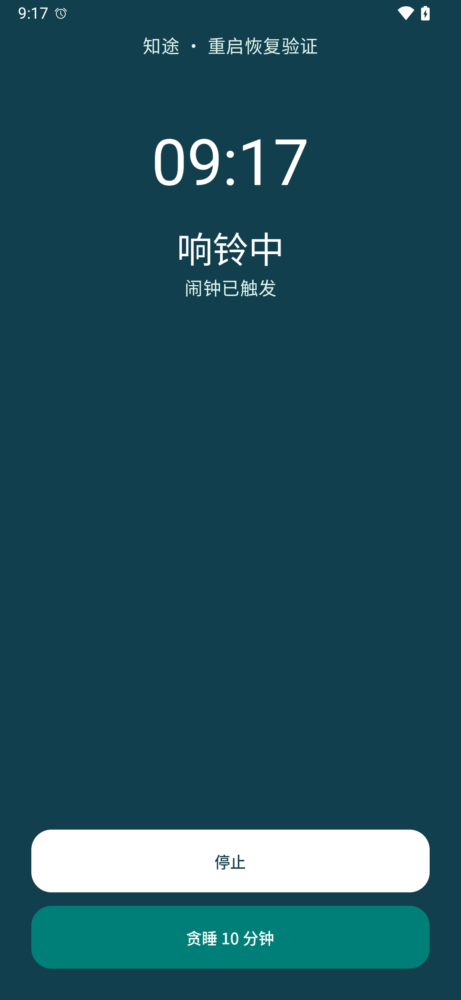

# Android 36 验证记录

- 日期：2026-09-01
- 设备：`Mi_15_Ultra` Android 36 模拟器，412 × 892 dp 竖屏
- APK：[`app-debug.apk`](../app/build/outputs/apk/debug/app-debug.apk)
- SHA-256：`e8547f2d6d52672a0cb46a2b787731f09e1e5e7d874667e9d8b835094ba95e69`

## 自动化结果

- `./gradlew :app:assembleDebug :app:assembleDebugAndroidTest testDebugUnitTest --continue --offline`：通过。
- JVM 单元测试：129 项通过，0 失败（model 36、data 47、alarm 33、network 13）。
- Android 36 设备测试：7 项通过，0 失败；覆盖真实触发／音频播放状态、停止、同刻多实例隔离、1 分钟贪睡后二次触发、编辑替换、关闭取消、凭据加密和两个 Compose 创建／取消流程。
- `CalendarNetworkDeviceTest`：从 `https://raw.githubusercontent.com/NateScarlet/holiday-cn/master/2026.json` 获取并校验 39 个日期状态，缓存状态和来源 URL 正常。
- Web 原型：15 项通过，0 失败。

## Direct Boot

使用只读 Android 36 模拟器的临时 PIN 做了真实重启测试：

1. 闹钟快照写入 `/data/user_de/0/<package>/files/datastore/`，不访问凭据保护目录。
2. 重启后用户状态保持 `RUNNING_LOCKED`，系统 `AlarmManager` 中可见本 App 精确闹钟。
3. 到点后启动 `AlarmRingingService` 前台服务，并显示 `AlarmRingingActivity`；服务启动原因记录为 `ALARM_MANAGER_ALARM_CLOCK`。
4. 解锁后快照、Room occurrence 和 `TRIGGERED` 历史完成收敛；测试计划被停止并清理。
5. 临时 PIN 已清除。

## 页面截图

## 验证边界

- 模拟器以 `-no-audio` 启动，自动化已断言应用内活动播放配置为 `USAGE_ALARM`；未通过宿主扬声器人工听音。
- 尚未在实体 Android 设备、厂商系统或 Google Play 发布环境验收。
- 地图、高德路线、彩云天气仍未接入，页面只显示留白状态。
